# Computer Networks & IoT — Solved Question Bank

> Complete 7-mark answers with Mermaid diagrams and LaTeX math.
> Renders natively on GitHub — no images, no external assets.

---

## Contents

| # | Question |
|---|---|
| 1 | [Framing and its Types](#1-framing-and-its-types) |
| 2 | [Byte Stuffing](#2-byte-stuffing) |
| 3 | [Network Topologies](#3-network-topologies) |
| 4 | [Bandwidth–Delay Product & Utilisation](#4-bandwidthdelay-product--utilisation-numerical) |
| 5 | [CIDR Notation](#5-cidr-notation) |
| 6 | [Classful Addressing Scheme](#6-classful-addressing-scheme) |
| 7 | [Mesh Topology — Advantages & Disadvantages](#7-mesh-topology--advantages-and-disadvantages) |
| 8 | [CRC Problem](#8-crc-problem) |
| 9 | [TCP/IP Protocol Architecture](#9-tcpip-protocol-architecture) |
| 10 | [IEEE WF-IoT Reference Architecture](#10-ieee-wf-iot-reference-architecture) |
| 11 | [OT and IT Responsibilities](#11-ot-and-it-responsibilities) |
| 12 | [ISP Address Allocation Problem](#12-isp-address-allocation-problem) |
| 13 | [Sliding Window — Selective Repeat ARQ](#13-sliding-window-protocol--selective-repeat-arq) |
| 14 | [Hamming Code Generation](#14-hamming-code-generation) |
| 15 | [Stop-and-Wait ARQ](#15-stop-and-wait-arq) |

---

## 1. Framing and its Types

**Definition.** The data link layer receives a raw bit stream from the physical layer. **Framing** is the process of dividing this continuous stream into manageable, identifiable units called *frames*, each carrying a source address, destination address, control information and payload. Framing lets the receiver know where one message ends and the next begins.

### Why framing is needed

- Error control becomes practical — if one frame is corrupted, only that frame is retransmitted.
- Allows addressing, so a message reaches the correct node on a shared medium.
- Provides synchronisation between sender and receiver.

### General frame structure


### Types of Framing

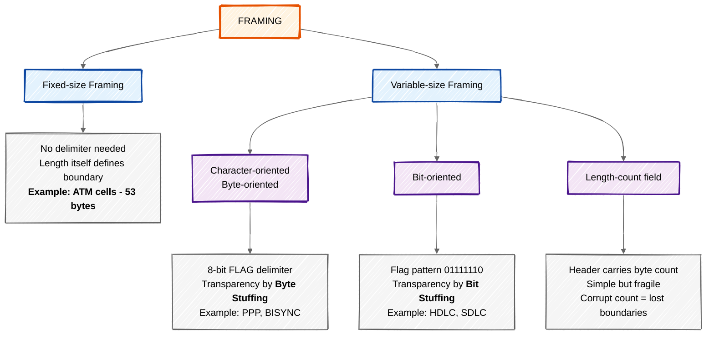

#### A. Fixed-size framing
Every frame has the same, pre-agreed length, so no delimiter is required. Used by **ATM** (53-byte cells).
*Drawback:* internal fragmentation when the data is smaller than the frame; inflexible.

#### B. Variable-size framing
Frame length varies, so an explicit boundary marker is required.

**(i) Character-oriented (byte-oriented)** — data is a sequence of 8-bit characters (ASCII/EBCDIC). A special 8-bit **flag** byte marks start and end. If the flag pattern appears inside the data, **byte stuffing** restores transparency.

**(ii) Bit-oriented** — data is a plain sequence of bits. The delimiter is the pattern $01111110$. Transparency is achieved by **bit stuffing**: insert a $0$ after five consecutive $1$s.

**(iii) Length-count framing** — a header field states the number of bytes in the frame. Simple, but a corrupted count field destroys all subsequent frame boundaries.

### Comparison

| Basis | Fixed-size | Character-oriented | Bit-oriented |
|---|---|---|---|
| Delimiter | Not needed | Flag byte | Flag pattern `01111110` |
| Transparency method | — | Byte stuffing | Bit stuffing |
| Data unit | Bits | 8-bit characters | Bits |
| Overhead | None | High | Low |
| Example | ATM | PPP, BISYNC | HDLC, SDLC |

---

## 2. Byte Stuffing

**Need.** In character-oriented framing the flag byte `01111110` marks the frame boundary. If this same pattern appears inside the *data* — which happens with images, executables and compressed files — the receiver would wrongly conclude the frame has ended. This destroys **data transparency**.

**Definition.** Byte stuffing (character stuffing) is the process of adding one extra 8-bit **escape character** (`ESC = 01111101`) to the data section of a frame whenever a byte matching the **FLAG** or the **ESC** character itself occurs.

### Algorithm

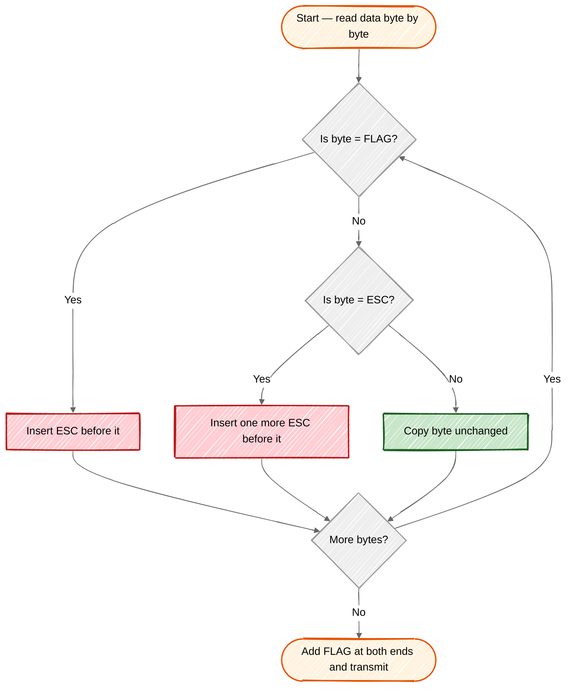

### Rules

1. Sender scans the data field byte by byte.
2. If a byte equals **FLAG** $\rightarrow$ insert an **ESC** before it.
3. If a byte equals **ESC** $\rightarrow$ insert another **ESC** before it.
4. The receiver removes every ESC and treats the byte that follows as ordinary data.

### Example

Let **FLAG = F** and **ESC = E**. Original data:

```
A   B   F   C   E   D
```

Transmitted frame after stuffing:

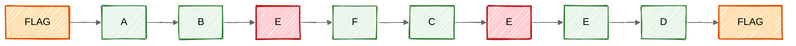

> Red bytes are the **stuffed** escape characters — they are removed by the receiver.

**At the receiver:**
- First `E` removed $\rightarrow$ the following `F` is accepted as **data**, not as a flag.
- Second `E` removed $\rightarrow$ the following `E` is accepted as **data**.
- Recovered data $=$ `A B F C E D` — identical to the original. ✔

### Numeric illustration

| | Bit pattern |
|---|---|
| FLAG | `01111110` |
| ESC | `01111101` |
| Original data | `11001100` **`01111110`** `10101010` |
| Transmitted | `01111110` · `11001100` · **`01111101 01111110`** · `10101010` · `01111110` |

**Advantage:** guarantees transparency for any binary data.
**Disadvantage:** frame size grows; tied to 8-bit character sets, so unsuitable for 16-bit coding systems such as Unicode — bit stuffing is preferred there.

---

## 3. Network Topologies

**Topology** is the geometric or logical arrangement of links and nodes — how devices are interconnected.

### (a) Bus Topology

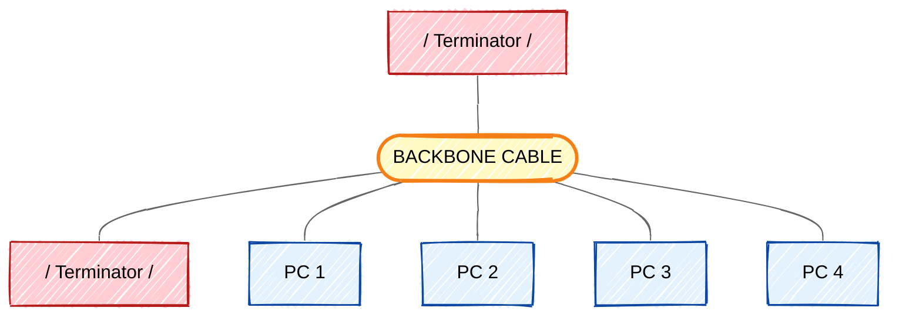

All devices tap into a single backbone; terminators absorb signals at both ends.

- **Advantages:** least cabling, cheapest, easy to install for small networks.
- **Disadvantages:** backbone failure kills the whole network; difficult fault isolation; heavy collisions; signal reflection at taps.

### (b) Star Topology

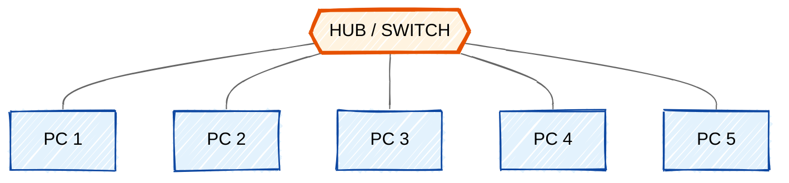

Every device has a dedicated point-to-point link to a central hub or switch.

- **Advantages:** easy to install and reconfigure; one link failure affects only one node; simple fault identification; less cable than mesh.
- **Disadvantages:** the hub is a single point of failure; more cable than bus; hub cost.

### (c) Ring Topology

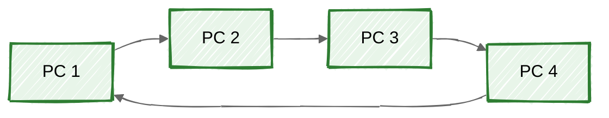

Each device links only to its two neighbours; the signal travels one way and is regenerated by every repeater.

- **Advantages:** easy to install; simple fault isolation via alarm signal; no collisions with token passing.
- **Disadvantages:** a single break disrupts the whole ring (solved by a dual ring); unidirectional traffic adds delay; adding a node breaks the ring.

### (d) Mesh Topology

Every device has a dedicated link to every other device — see [Question 7](#7-mesh-topology--advantages-and-disadvantages) for detail.

```math
\text{Number of duplex links} = \frac{n(n-1)}{2} \qquad\qquad \text{I/O ports per device} = n-1
```

### (e) Tree (Hierarchical) Topology

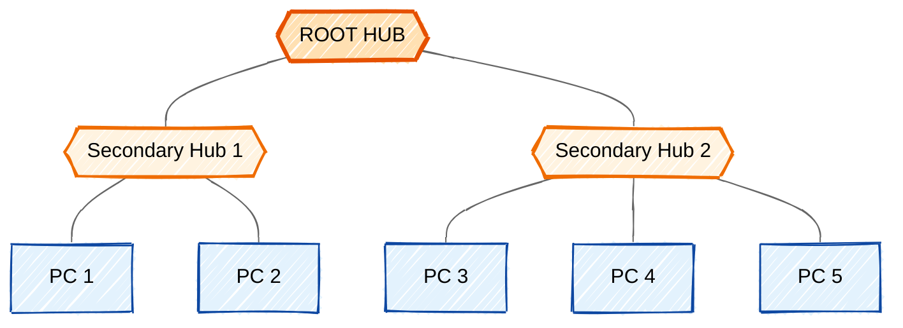

A variation of star where secondary hubs connect to a central root hub.

- **Advantages:** supports many devices, signal regeneration at each hub, easy expansion, group isolation.
- **Disadvantages:** root failure collapses the network; more cabling; harder to configure.

### (f) Hybrid Topology

A combination of two or more topologies (star-bus, star-ring), used in most large real networks.

- **Advantages:** flexible, scalable, reliable, faults confined to a segment.
- **Disadvantages:** complex design, expensive hubs and switches.

### Comparison

| Topology | Links needed | Cost | Reliability | Fault isolation |
|---|---|---|---|---|
| Bus | 1 backbone | Very low | Low | Difficult |
| Star | $n$ | Moderate | Good, except hub | Easy |
| Ring | $n$ | Low | Moderate | Moderate |
| Mesh | $n(n-1)/2$ | Very high | Very high | Very easy |
| Tree | $n$ | Moderate–high | Moderate | Easy |

---

## 4. Bandwidth–Delay Product & Utilisation (Numerical)

### Bandwidth–Delay Product

**Definition.** The bandwidth-delay product is the product of the link bandwidth and the round-trip delay:

```math
\mathrm{BDP} = \text{Bandwidth} \times \text{Round-trip Delay}
```

**Meaning.** It gives the **maximum number of bits that can be in transit on the link at any instant** — the "volume" of the pipe. It is the number of bits a sender may transmit before the first acknowledgement can possibly return, and therefore defines the **optimum window size** of a sliding-window protocol.

- Window size $<$ BDP $\Rightarrow$ link under-utilised (sender idles).
- Window size $=$ BDP $\Rightarrow$ link 100 % utilised.

### Given

| Quantity | Value |
|---|---|
| Bandwidth $B$ | $2\ \text{Mbps} = 2 \times 10^{6}$ bits/s |
| Round-trip time for 1 bit | $20\ \text{ms} = 20 \times 10^{-3}$ s |
| Frame size $L$ | $1000$ bits |
| Protocol | Stop-and-Wait ARQ |

### Step 1 — Bandwidth-Delay Product

```math
\mathrm{BDP} = B \times \mathrm{RTT} = (2 \times 10^{6}) \times (20 \times 10^{-3}) = 40{,}000 \text{ bits}
```

$$\boxed{\mathrm{BDP} = 40{,}000\ \text{bits} = 40\ \text{kbits}}$$

The link can hold 40,000 bits in flight during one round trip.

### Step 2 — Link Utilisation

In Stop-and-Wait ARQ the sender transmits **only one frame** and then waits idle for the entire round-trip time.

```math
\eta = \frac{\text{Frame size}}{\mathrm{BDP}} = \frac{1000}{40{,}000} = 0.025 = 2.5\%

$$\boxed{\text{Link utilisation} = 2.5\%}$$
```


### Interpretation

Only 1000 of the 40,000 possible in-flight bits are used, so **97.5 % of the link capacity is wasted**. To reach 100 % utilisation the sender would need a window of

```math
W = \frac{\mathrm{BDP}}{L} = \frac{40{,}000}{1000} = 40 \text{ frames}
```

i.e. a sliding-window protocol (Go-Back-N or Selective Repeat) with window size $\geq 40$.

> **Note.** Using the full efficiency formula $\eta = T_t / (T_t + 2T_p)$ with $T_t = 1000/(2\times10^6) = 0.5$ ms and $2T_p = 20$ ms gives $\eta = 0.5/20.5 \approx 2.44\%$. Both answers appear in textbooks; **2.5 %** is the standard BDP-ratio answer.

---

## 5. CIDR Notation

**CIDR = Classless Inter-Domain Routing** (RFC 1519), introduced in 1993 to replace the rigid classful scheme.

**Definition.** CIDR notation writes an IP address together with the length of its network prefix:

```math
\underbrace{x.y.z.w}_{\text{32-bit address}} \; / \; \underbrace{n}_{\text{prefix length}}
```

where $n$ leading bits identify the **network** and the remaining $32 - n$ bits identify the **host**.

### Key relationships

```math
\text{Subnet mask} = \underbrace{11\ldots1}_{n \text{ ones}}\underbrace{00\ldots0}_{32-n \text{ zeros}}
```

```math
\text{Total addresses} = 2^{\,32-n} \qquad\qquad \text{Usable hosts} = 2^{\,32-n} - 2
```

```math
\text{First address} = \text{IP} \;\text{AND}\; \text{Mask} \qquad\qquad \text{Last address} = \text{IP} \;\text{OR}\; \overline{\text{Mask}}
```

Two zero addresses are subtracted for the **network address** and the **broadcast address**.

### Constraints on a valid block

1. The number of addresses must be a **power of 2**.
2. The **first address must be divisible by the block size**.
3. Addresses must be **contiguous**.

### Worked example — `192.168.10.0/26`

| Item | Value |
|---|---|
| Prefix length | 26 bits |
| Subnet mask | `255.255.255.192` |
| Block size | $2^{32-26} = 2^{6} = 64$ addresses |
| Network address | `192.168.10.0` |
| Broadcast address | `192.168.10.63` |
| Usable host range | `192.168.10.1` – `192.168.10.62` |
| Usable hosts | $64 - 2 = 62$ |

### Advantages of CIDR

- **Efficient utilisation** — blocks of any power-of-two size (VLSM), slowing IPv4 exhaustion.
- **Route aggregation / supernetting** — many contiguous networks advertised as one route, shrinking routing tables. For example `200.1.0.0/22` replaces four separate `/24` routes.
- **Hierarchical allocation** — ISPs receive large blocks and sub-allocate flexibly.
- Removes the artificial Class A/B/C boundaries entirely.

---

## 6. Classful Addressing Scheme

In the original IPv4 design the 32-bit space was split into five fixed classes determined by the **leading bits** of the first octet. Each address has a **NetID** and a **HostID** whose lengths are fixed by the class.

### Class identification

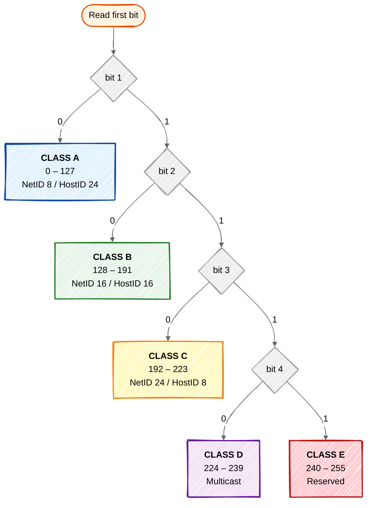

### The five classes

| Class | Leading bits | First octet | NetID / HostID | Networks | Hosts per network | Default mask |
|---|---|---|---|---|---|---|
| **A** | `0` | 0 – 127 | 8 / 24 | $2^{7} = 128$ | $2^{24}-2 = 16{,}777{,}214$ | `255.0.0.0` (/8) |
| **B** | `10` | 128 – 191 | 16 / 16 | $2^{14} = 16{,}384$ | $2^{16}-2 = 65{,}534$ | `255.255.0.0` (/16) |
| **C** | `110` | 192 – 223 | 24 / 8 | $2^{21} = 2{,}097{,}152$ | $2^{8}-2 = 254$ | `255.255.255.0` (/24) |
| **D** | `1110` | 224 – 239 | Multicast — no host part | — | — | Not defined |
| **E** | `1111` | 240 – 255 | Reserved / experimental | — | — | Not defined |

### Bit structure

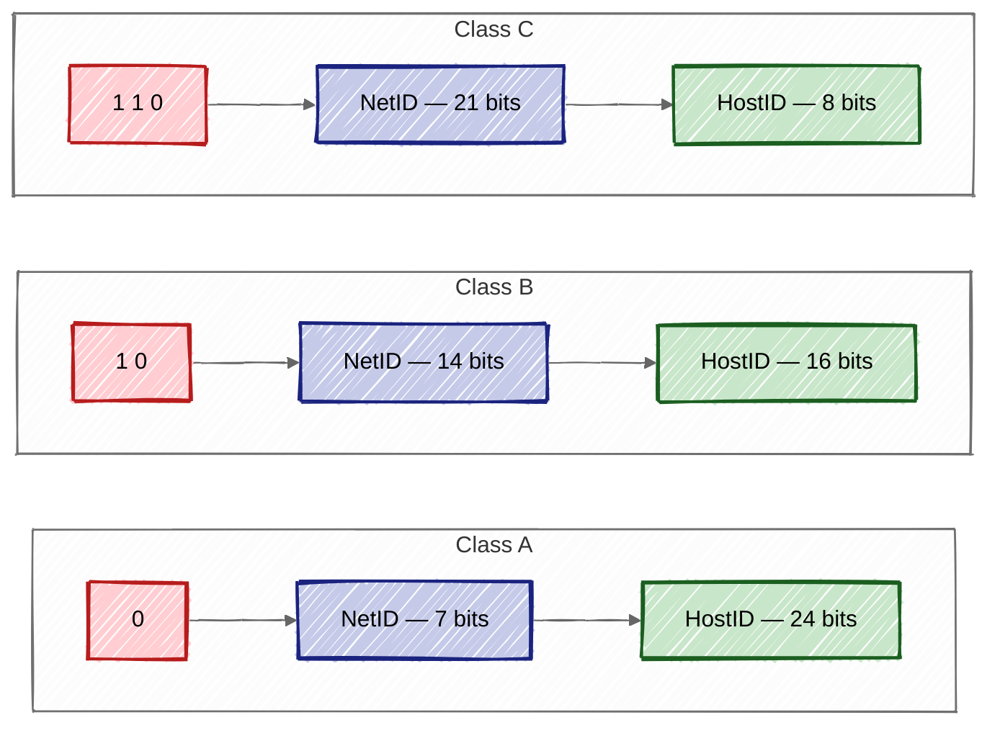

### Address-space occupancy

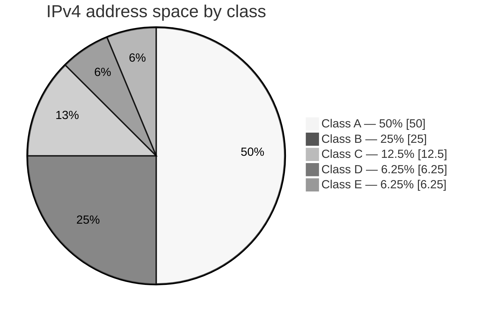

### Special / reserved addresses

| Address | Purpose |
|---|---|
| `127.0.0.0/8` | Loopback (`127.0.0.1`) |
| `0.0.0.0` | This host / default route |
| `255.255.255.255` | Limited broadcast |
| `10.0.0.0/8`, `172.16.0.0/12`, `192.168.0.0/16` | Private address ranges |

### Advantages

- Simple — the class, and therefore the mask, is derivable from the address itself, so no mask needs to be carried in routing updates.
- Routers extract the NetID quickly with a fixed bit test.

### Disadvantages — why it was abandoned

- **Severe address wastage.** An organisation with 300 hosts needed a Class B block of 65,534 addresses, wasting over 65,000. One with 2 hosts still consumed a full Class C.
- **Rapid depletion** of Class B addresses.
- **Routing-table explosion** — no aggregation possible.
- **Coarse granularity** — nothing available between 254 and 65,534 hosts.

These problems led first to subnetting and then to **CIDR / classless addressing**.

---

## 7. Mesh Topology — Advantages and Disadvantages

**Definition.** In a mesh topology every device has a **dedicated point-to-point link** with every other device. Each link carries traffic only between the two devices it connects.

```math
\text{Links} = \frac{n(n-1)}{2} \qquad\qquad \text{Ports per device} = n - 1
```

For $n = 6$: links $= \dfrac{6 \times 5}{2} = 15$, with 5 ports per node.

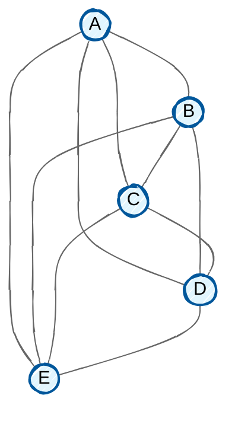

*Full mesh with $n=5$ — every node linked to every other, giving $5\times4/2 = 10$ links.*

### Growth of cabling cost

| Nodes $n$ | Links $n(n-1)/2$ | Ports per node |
|---|---|---|
| 5 | 10 | 4 |
| 10 | 45 | 9 |
| 25 | 300 | 24 |
| 50 | 1,225 | 49 |
| 100 | 4,950 | 99 |

### Advantages

1. **Dedicated links, no contention** — each link carries the traffic of only two devices, eliminating sharing problems and collisions; bandwidth is guaranteed.
2. **High robustness and fault tolerance** — the failure of one link does not disable the system; traffic reroutes through alternative paths.
3. **Privacy and security** — a message travels along a dedicated line seen only by the intended receiver.
4. **Easy fault identification and isolation** — faults localise to a single link, and traffic can be routed to avoid a suspected one.
5. **No single point of failure**, unlike the hub in star or the backbone in bus.
6. **Low latency, high throughput** — no queuing behind other nodes' traffic.
7. **Expansion does not disturb existing users** in a partial mesh.

### Disadvantages

1. **Huge cabling requirement** — $n(n-1)/2$ links; 100 nodes need 4,950 links.
2. **Large number of I/O ports** — every node needs $n-1$ interfaces, raising hardware cost.
3. **Very high installation cost** — cable, ducts, connectors and NICs dominate the budget.
4. **Difficult installation and reconfiguration** — the physical bulk of wiring may exceed the space available in walls, ceilings and floors.
5. **Poor scalability** — cost grows as $O(n^2)$; adding one node requires links to every existing node.
6. **High maintenance overhead** with much redundant, unused capacity.

### Practical use

Because of cost, a **full mesh** is used only where reliability is critical and the node count is small — the backbone of a telephone network, links between an ISP's core routers, or a hybrid design where a mesh backbone joins star-connected LANs. Wireless networks such as WSN, Zigbee and IoT meshes use **partial mesh** freely, since the cabling cost disappears.

---

## 8. CRC Problem

**Given**

| Item | Value |
|---|---|
| Message (dataword) $M$ | `11100011` — 8 bits |
| Generator polynomial | $G(x) = x^{3} + x^{2} + 1$ |
| Divisor bit pattern | `1101` — 4 bits |
| Degree $r$ | $3$ $\Rightarrow$ 3 CRC bits |

Deriving the divisor from the polynomial:

```math
G(x)=x^{3}+x^{2}+0\cdot x^{1}+1 \;\longrightarrow\; 1\,1\,0\,1
```

### CRC process

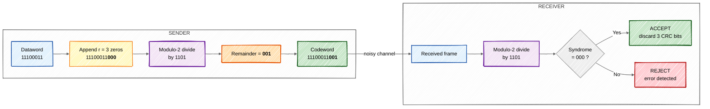

### (i) Determine the Transmitted Frame

**Step 1 — Append $r = 3$ zeros**

```math
\text{Dividend} = 11100011 \,\|\, 000 = 11100011000
```

**Step 2 — Modulo-2 (XOR) division by `1101`**

```
                    1 0 1 0 0 1 1 0
             ┌──────────────────────────
      1101   │ 1 1 1 0 0 0 1 1 0 0 0
               1 1 0 1
               ───────
               0 0 1 1 0
                   0 0 0 0
                   ───────
                 0 1 1 0 0
                   1 1 0 1
                   ───────
                   0 0 0 1 1
                       0 0 0 0
                       ───────
                       0 0 1 1 1
                           0 0 0 0
                           ───────
                           0 1 1 1 0
                             1 1 0 1
                             ───────
                             0 0 1 1 0
                                 0 0 0 0
                                 ───────
                                 0 1 1 0 0
                                   1 1 0 1
                                   ───────
                                   0 0 0 1   ← Remainder = 001
```

**Remainder (CRC) $= 001$**

**Step 3 — Form the codeword.** Replace the appended zeros with the remainder:

```math
\text{Codeword} = \underbrace{11100011}_{\text{dataword}} \;\|\; \underbrace{001}_{\text{CRC}}
```

$$\boxed{\text{Transmitted frame} = 1\,1\,1\,0\,0\,0\,1\,1\,0\,0\,1 \quad (11 \text{ bits})}$$

**Verification (error-free case).** Dividing `11100011001` by `1101` gives remainder `000`, so the frame is accepted. ✔

### (ii) Last Bit Flipped — Is the Error Detected?

```math
\text{Transmitted: } 1110001100\mathbf{1} \;\;\xrightarrow{\text{bit 11 flipped}}\;\; \text{Received: } 1110001100\mathbf{0}
```

Dividing the received frame `11100011000` by `1101` is exactly the division already performed in Step 2, whose remainder was `001`.

| | |
|---|---|
| Received frame | `11100011000` |
| Divisor | `1101` |
| **Syndrome (remainder)** | **`001`** $\neq$ `000` |

$$\boxed{\text{Syndrome} \neq 0 \;\Rightarrow\; \textbf{Error IS detected}}$$

The receiver discards the frame and requests retransmission.

**Reason.** A generator polynomial with more than one term and a non-zero constant term ($x^{0} = 1$) detects **all single-bit errors**. Here $G(x) = x^{3}+x^{2}+1$ satisfies this, so a single-bit error at any position produces a non-zero syndrome.

### Error-detection capability of CRC

| Error type | Detected? | Condition on $G(x)$ |
|---|---|---|
| All single-bit errors | Yes | At least two terms, constant term $= 1$ |
| All double-bit errors | Yes | $G(x)$ does not divide $x^{k}+1$ for small $k$ |
| Any odd number of errors | Yes | $G(x)$ contains the factor $(x+1)$ |
| Burst errors of length $\leq r$ | Yes | Degree of $G(x) = r$ |
| Burst errors of length $> r$ | With probability $1 - 2^{-r}$ | — |

---

## 9. TCP/IP Protocol Architecture

The **TCP/IP protocol suite** is the de-facto standard on which the Internet is built. It is a **hierarchical, layered set of interactive modules**, each providing a specific functionality, and each relatively independent so it can be modified without disturbing the others. The original model had four layers; it is commonly drawn today as **five**.

### Layer mapping with the OSI model

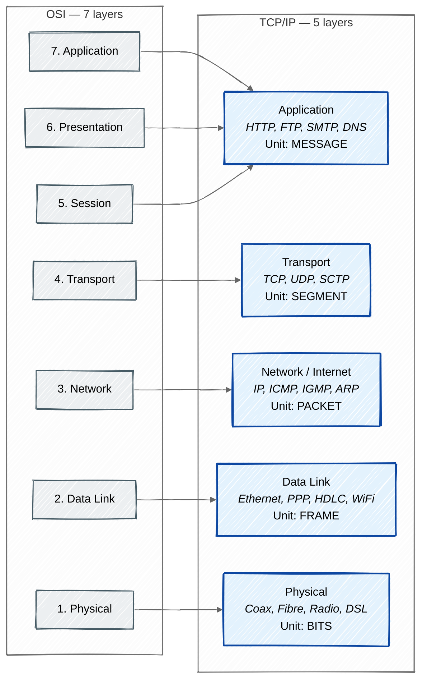

### Layer-by-layer description

**1. Physical Layer** — transmits individual **bits** over the medium. Defines mechanical and electrical specifications, voltage levels, data rate, bit synchronisation, transmission mode (simplex / half-duplex / full-duplex) and physical topology. Devices: hubs, repeaters, cables, connectors.

**2. Data Link Layer** — groups bits into **frames**; provides node-to-node (hop-to-hop) delivery. Functions: **framing, physical (MAC) addressing, flow control, error control via CRC, and access control** for the shared medium. Protocols: Ethernet (IEEE 802.3), Wi-Fi (802.11), PPP, HDLC. Devices: switches, bridges, NICs.

**3. Network / Internet Layer** — provides **host-to-host (source-to-destination) delivery** across multiple networks.

| Protocol | Role |
|---|---|
| **IP** (IPv4 / IPv6) | Connectionless, unreliable, best-effort datagram delivery; logical addressing, routing, fragmentation and reassembly |
| **ICMP** | Error reporting and query messages — `ping`, `traceroute` |
| **IGMP** | Multicast group management |
| **ARP** | Maps logical IP address $\rightarrow$ physical MAC address |
| **RARP** | Maps MAC $\rightarrow$ IP (obsolete, replaced by DHCP) |

Routing protocols: RIP, OSPF, BGP. Device: **router**.

**4. Transport Layer** — provides **process-to-process (end-to-end) delivery** using **port numbers**.

| | TCP | UDP |
|---|---|---|
| Connection | Connection-oriented (3-way handshake) | Connectionless |
| Reliability | Reliable — ACK, sequencing, retransmission | Unreliable, best effort |
| Header size | 20 bytes | 8 bytes |
| Flow / congestion control | Yes (sliding window) | No |
| Ordering | Guaranteed | Not guaranteed |
| Speed | Slower | Faster |
| Used by | HTTP, FTP, SMTP, SSH | DNS, DHCP, TFTP, VoIP, streaming |

**SCTP** combines features of both, adding multi-streaming and multi-homing, and is used in telecom signalling.

**5. Application Layer** — combines the OSI application, presentation and session layers. Provides services directly to the user and defines message formats: **HTTP/HTTPS**, **FTP**, **SMTP/POP3/IMAP**, **DNS**, **TELNET/SSH**, **SNMP**, **DHCP**, and the IoT protocols **MQTT/CoAP**.

### Encapsulation

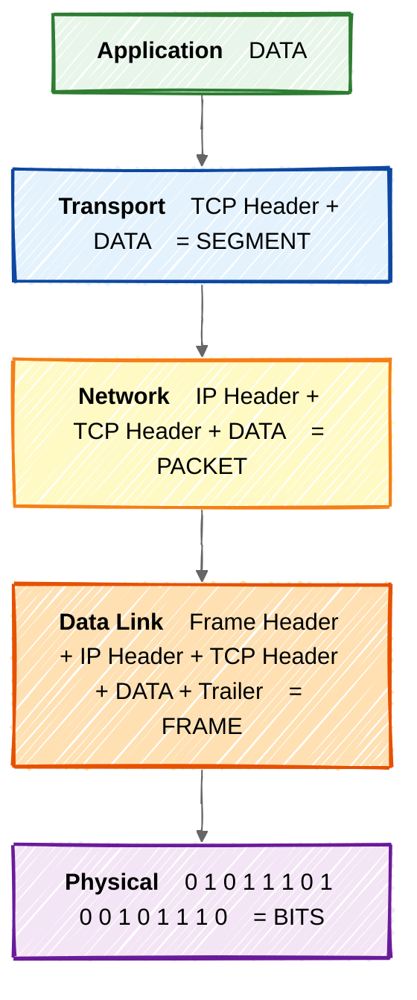

Each layer adds its own header on the way down; the data link layer also adds a trailer. The reverse process, **decapsulation**, strips them on the way up at the receiver.

### Advantages

Open standard and vendor-independent; scalable; routes across heterogeneous networks; proven by universal deployment; flexible, with several protocol choices per layer.

### Limitations

Layers are not cleanly separated — the application layer merges three OSI layers; there is no clear distinction between service, interface and protocol; and because the model was derived *after* its protocols, it does not generalise well to other stacks.

---

## 10. IEEE WF-IoT Reference Architecture

The **IEEE World Forum on Internet of Things (WF-IoT) Reference Model**, presented in 2014, is a **seven-level** architecture describing how data flows from physical "things" up to business processes and people. Data moving **up** is progressively processed and abstracted; control commands flow **down**.

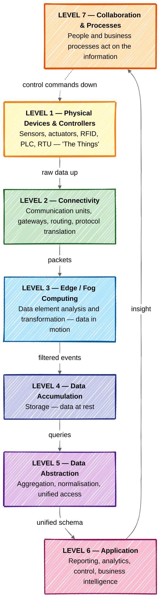

### Level 1 — Physical Devices and Controllers ("The Things")

Sensors, actuators, RFID tags, machines, RTUs, PLCs, smart meters and wearables. They generate raw data and are the endpoints that can be queried and controlled over the network. Characterised by constrained power, memory and processing, and by an enormous diversity of form factors.

### Level 2 — Connectivity

Reliable and timely transmission of data between devices, between the network and Level 3, and across networks. Includes gateways, routers and switches, plus protocol translation (Zigbee / BLE / LoRa $\leftrightarrow$ IP). Functions: device-to-network communication, network routing, translation and network-level security.

### Level 3 — Edge (Fog) Computing

Converts network data flows into information suitable for storage and higher-level processing — **data in motion**. Performed as close to the edge as possible. Activities: evaluating and filtering data, formatting, expanding and decoding, distillation and reduction, event generation and alarming. Benefits: lower bandwidth consumption and low-latency local response.

### Level 4 — Data Accumulation

Converts **data in motion into data at rest**. Event-based, real-time streams are captured and stored so applications can access them non-real-time on demand. Functions: converting packets to database tables, transitioning from event-driven to query-driven access, judging whether data is of interest, and reducing data volume.

### Level 5 — Data Abstraction

Renders stored data and its storage usable by applications — aggregating data from multiple formats and sources into a single schema, reconciling differences, normalising and denormalising, indexing, and providing consistent semantics and access control. It gives applications a **simple, unified view** of heterogeneous data.

### Level 6 — Application

Interprets information for business purposes: control applications, monitoring and reporting dashboards, business intelligence, analytics and machine learning. Ranges from simple device monitoring to complex predictive analytics.

### Level 7 — Collaboration and Processes

IoT becomes useful only when **people and business processes** act on the information. This level covers communication and collaboration — sharing insights across departments, triggering workflows and enabling business decisions. It may span multiple organisations.

### Significance of the model

- Provides a **common vocabulary** and clear separation of concerns for IoT design.
- Shows where processing, storage and security must be applied at each level.
- Makes explicit that **security must be implemented at every level**, not bolted on afterwards.
- Helps decide edge-versus-cloud placement of functions.

---

## 11. OT and IT Responsibilities

**IT (Information Technology)** deals with systems that store, process and transmit **information** — data-centric business systems.
**OT (Operational Technology)** deals with hardware and software that **detect or cause changes in physical processes** — machines, valves, motors, turbines, assembly lines.

IoT succeeds only where **IT and OT converge**, because IoT data originates in the OT domain but is analysed and consumed in the IT domain.

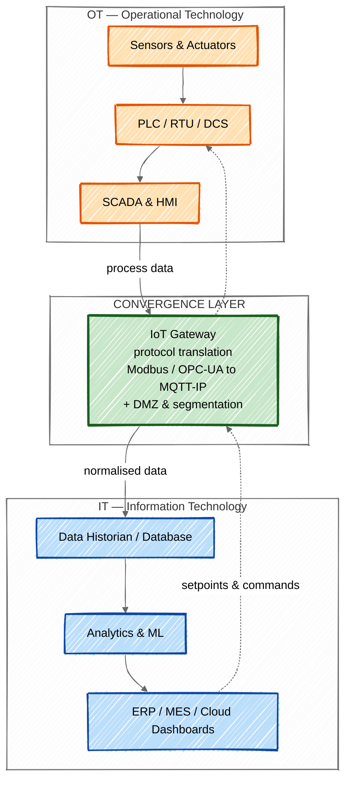

### Responsibilities of IT

| Area | IT responsibility |
|---|---|
| Focus | Data, information, transactions |
| Systems | Servers, databases, ERP/CRM, e-mail, cloud, enterprise networks |
| Primary goal | **Confidentiality** first — C-I-A priority |
| Uptime | Scheduled downtime acceptable; frequent patching |
| Lifecycle | 3–5 years, regular upgrades |
| Protocols | TCP/IP, HTTP, SNMP, standard Ethernet |
| Security | Firewalls, antivirus, IDS/IPS, encryption, IAM, patch management |
| Data handling | Storage, backup, analytics, governance, compliance |
| Interfaces | Human-facing applications, dashboards, reporting |
| Key metric | Data integrity and throughput |

### Responsibilities of OT

| Area | OT responsibility |
|---|---|
| Focus | Physical processes, machinery, production |
| Systems | SCADA, DCS, PLC, RTU, HMI, industrial sensors and actuators |
| Primary goal | **Availability and safety** first — A-I-C priority |
| Uptime | 24×7×365; downtime is costly or unsafe, so patching is rare |
| Lifecycle | 15–30 years; legacy equipment common |
| Protocols | Modbus, PROFIBUS/PROFINET, DNP3, BACnet, OPC-UA, CAN, fieldbus |
| Security | Physical access control, air-gapping and segmentation, safety instrumented systems |
| Data handling | Real-time control loops, deterministic latency, alarm handling |
| Interfaces | Machine-facing control, HMI panels |
| Key metric | Process safety, reliability, real-time response |

### Comparison summary

| Parameter | IT | OT |
|---|---|---|
| Deals with | Information and data | Physical equipment and processes |
| Security priority | Confidentiality → Integrity → Availability | Availability → Integrity → Confidentiality |
| Timing | Non-real-time, delay tolerable | Hard real-time, deterministic |
| Failure impact | Data loss, financial loss | Equipment damage, injury, loss of life |
| Environment | Air-conditioned data centres | Harsh — heat, vibration, dust, moisture |
| Update cycle | Frequent | Very infrequent |
| Managed by | CIO / IT department | Plant, engineering and operations |

### IT–OT convergence in IoT

IoT bridges the two: OT devices are connected to IP networks so IT systems can analyse their data for predictive maintenance, energy optimisation and quality analytics.

**Benefits** — unified data, better decisions, lower cost, remote monitoring.
**Challenges** — legacy OT systems lack authentication and encryption, so connecting them expands the attack surface (as Stuxnet demonstrated); differing cultures, skill sets and priorities; protocol incompatibility.
**Solutions** — IoT gateways for protocol translation, network segmentation using the Purdue model with a DMZ, and joint IT-OT governance teams.

---

## 12. ISP Address Allocation Problem

**Given:** the block `190.100.0.0/16`

```math
\text{Total addresses} = 2^{\,32-16} = 2^{16} = 65{,}536
```

Range: `190.100.0.0` – `190.100.255.255`

### Group 1 — 64 customers × 256 addresses

```math
256 = 2^{8} \Rightarrow \text{host bits}=8 \Rightarrow \text{prefix}=32-8=\mathbf{/24}
```
```math
\text{Group total} = 64 \times 256 = 16{,}384 \text{ addresses}
```

| Customer | Block | Range |
|---|---|---|
| 1 | `190.100.0.0/24` | `190.100.0.0` – `190.100.0.255` |
| 2 | `190.100.1.0/24` | `190.100.1.0` – `190.100.1.255` |
| ⋮ | ⋮ | ⋮ |
| 64 | `190.100.63.0/24` | `190.100.63.0` – `190.100.63.255` |

**Occupies `190.100.0.0` → `190.100.63.255`**, i.e. `190.100.0.0/18`

### Group 2 — 128 customers × 128 addresses

```math
128 = 2^{7} \Rightarrow \text{host bits}=7 \Rightarrow \text{prefix}=32-7=\mathbf{/25}
```
```math
\text{Group total} = 128 \times 128 = 16{,}384 \text{ addresses}
```

Starts at the next free address, `190.100.64.0`.

| Customer | Block | Range |
|---|---|---|
| 1 | `190.100.64.0/25` | `190.100.64.0` – `190.100.64.127` |
| 2 | `190.100.64.128/25` | `190.100.64.128` – `190.100.64.255` |
| 3 | `190.100.65.0/25` | `190.100.65.0` – `190.100.65.127` |
| ⋮ | ⋮ | ⋮ |
| 128 | `190.100.127.128/25` | `190.100.127.128` – `190.100.127.255` |

**Occupies `190.100.64.0` → `190.100.127.255`**, i.e. `190.100.64.0/18`

### Group 3 — 128 customers × 64 addresses

```math
64 = 2^{6} \Rightarrow \text{host bits}=6 \Rightarrow \text{prefix}=32-6=\mathbf{/26}
```
```math
\text{Group total} = 128 \times 64 = 8{,}192 \text{ addresses}
```

Starts at `190.100.128.0`.

| Customer | Block | Range |
|---|---|---|
| 1 | `190.100.128.0/26` | `190.100.128.0` – `190.100.128.63` |
| 2 | `190.100.128.64/26` | `190.100.128.64` – `190.100.128.127` |
| 3 | `190.100.128.128/26` | `190.100.128.128` – `190.100.128.191` |
| 4 | `190.100.128.192/26` | `190.100.128.192` – `190.100.128.255` |
| ⋮ | ⋮ | ⋮ |
| 128 | `190.100.159.192/26` | `190.100.159.192` – `190.100.159.255` |

**Occupies `190.100.128.0` → `190.100.159.255`**, i.e. `190.100.128.0/19`

### Total allocated

```math
\begin{array}{lrcr}
\text{Group 1} & 64 \times 256 &=& 16{,}384\\
\text{Group 2} & 128 \times 128 &=& 16{,}384\\
\text{Group 3} & 128 \times 64 &=& 8{,}192\\

\textbf{Total} & &=& \mathbf{40{,}960}\ \text{addresses}
\end{array}
```

### Addresses still available

```math
\text{Available} = 65{,}536 - 40{,}960 = 24{,}576
```

$$\boxed{\text{Remaining} = 24{,}576 \text{ addresses} \;\;\big(\texttt{190.100.160.0} \rightarrow \texttt{190.100.255.255}\big)}$$

Expressed in CIDR the reserve is two blocks:

| Block | Addresses | Range |
|---|---|---|
| `190.100.160.0/19` | $8{,}192$ | `190.100.160.0` – `190.100.191.255` |
| `190.100.192.0/18` | $16{,}384$ | `190.100.192.0` – `190.100.255.255` |
| **Total** | $\mathbf{24{,}576}$ | ✔ |

### Allocation map

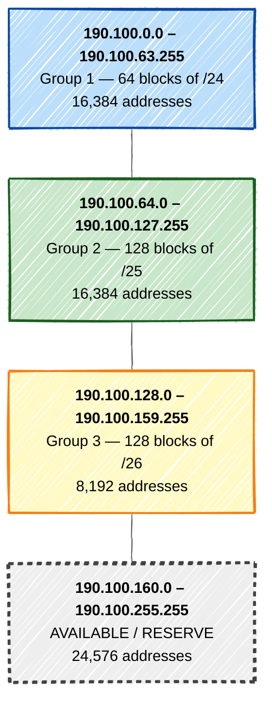

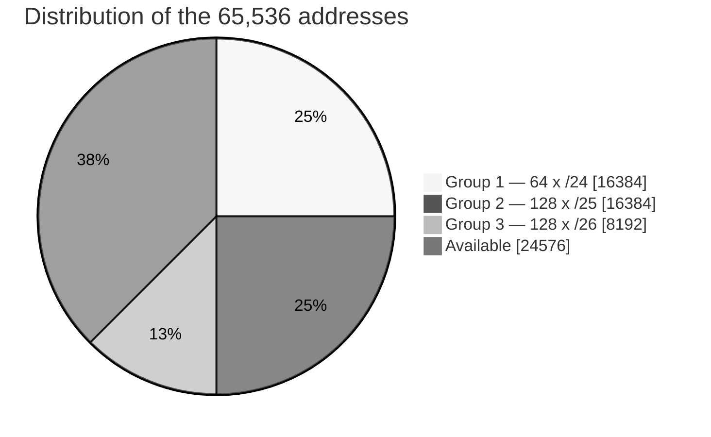

---

## 13. Sliding Window Protocol — Selective Repeat ARQ

### The sliding window concept

To overcome the inefficiency of Stop-and-Wait, sliding-window protocols allow the sender to transmit **several frames before receiving an acknowledgement**. Frames carry **sequence numbers** in the range $0$ to $2^{m}-1$ for an $m$-bit field, and the "window" is an imaginary box covering the frames that may currently be outstanding. As acknowledgements arrive, the window **slides** forward.

### Selective Repeat ARQ

In Go-Back-N, one lost frame forces retransmission of that frame **and every frame after it**, which wastes bandwidth on noisy links. **Selective Repeat retransmits only the specific damaged or lost frame.**

```math
\text{Sender window} = \text{Receiver window} = 2^{\,m-1}
```

For $m = 3$: sequence numbers $0\ldots7$ and window size $= 2^{2} = 4$.

### Key features

| Feature | Selective Repeat |
|---|---|
| Sender window size | $2^{m-1}$ |
| Receiver window size | $2^{m-1}$ — **greater than 1** |
| Out-of-order frames | **Accepted and buffered** |
| Acknowledgements | Individual per frame, plus **NAK** for a detected bad frame |
| Timers | **One timer per outstanding frame** |
| Retransmission | Only the specific bad frame |

### Operation

**Sender**
- Transmits frames while the window is not full and keeps a copy of every unacknowledged frame.
- Starts a timer for each frame sent.
- On ACK for frame $i$, marks $i$ acknowledged; the window slides **only when the frame at the left edge (base) is acknowledged**.
- On timeout or NAK for frame $i$, **retransmits only frame $i$**.

**Receiver**
- Accepts any frame whose sequence number falls inside the receive window, even out of order, and buffers it.
- Sends an ACK for each correctly received frame, and a NAK for a corrupted or missing one.
- Delivers frames to the network layer **only in order**, then slides past every contiguous correctly received frame.

### Flow diagram — Frame 2 is lost

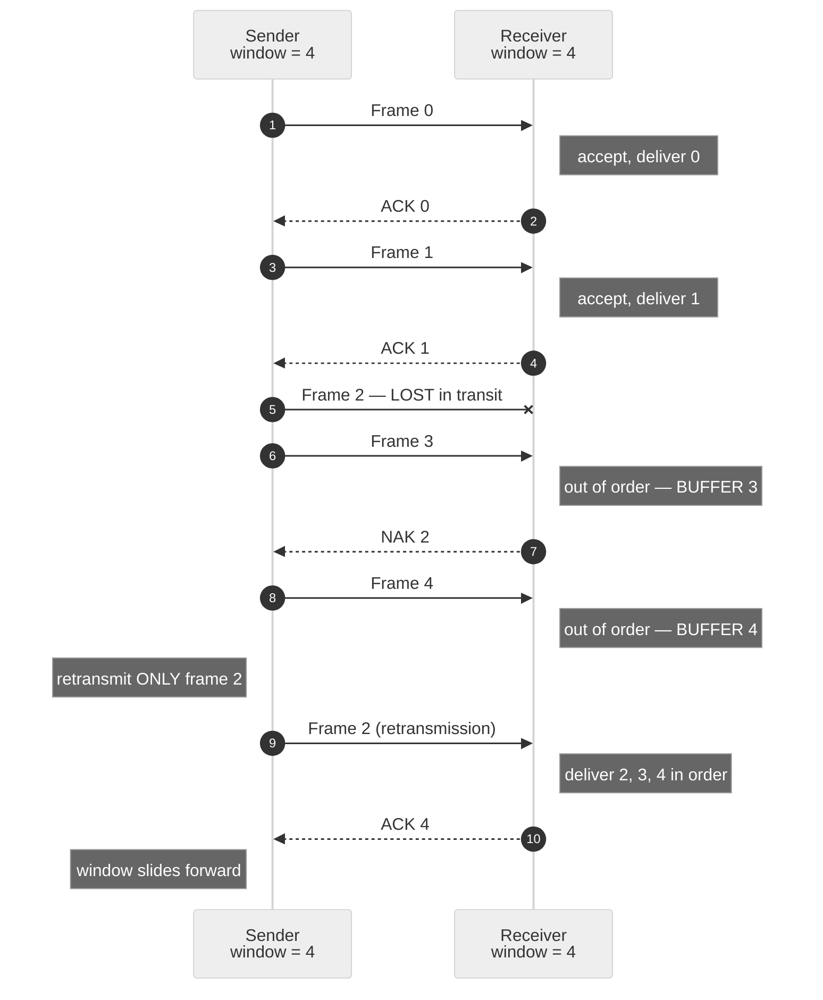

### Why the window is limited to $2^{m-1}$

If the window were larger, a duplicate retransmitted frame could fall inside the *new* receive window and be mistaken for a fresh frame. Limiting both windows to half the sequence space guarantees the old and new windows never overlap:

```math
W_{\text{send}} + W_{\text{recv}} \leq 2^{m} \;\;\Longrightarrow\;\; W = 2^{\,m-1}
```

### Efficiency

```math
\eta = \frac{W \cdot T_t}{T_t + 2T_p} = \frac{W}{1+2a} \quad (\text{capped at }1), \qquad a = \frac{T_p}{T_t}
```

### Advantages

- **Highest efficiency** of the three ARQ protocols — only the erroneous frame is resent.
- Excellent on **noisy links** and **high bandwidth-delay** paths.
- Fewer retransmissions, hence better bandwidth utilisation.

### Disadvantages

- Receiver needs **buffer memory** and sorting logic, so hardware is more complex.
- **A separate timer per outstanding frame** at the sender.
- Most complex of the three protocols to implement.

### Comparison of the three ARQ protocols

| Feature | Stop-and-Wait | Go-Back-N | Selective Repeat |
|---|---|---|---|
| Sender window | $1$ | $2^{m}-1$ | $2^{m-1}$ |
| Receiver window | $1$ | $1$ | $2^{m-1}$ |
| Out-of-order frames | Discarded | Discarded | Buffered |
| Retransmission | 1 frame | $N$ frames | Only the bad frame |
| ACK type | Individual | Cumulative | Individual + NAK |
| Number of timers | 1 | 1 | One per frame |
| Complexity | Lowest | Medium | Highest |
| Efficiency | Lowest | Medium | Highest |

---

## 14. Hamming Code Generation

**Hamming code** is a linear **error-correcting code** (FEC) developed by R. W. Hamming. It can **detect up to two-bit errors and correct any single-bit error** by inserting parity bits at specific positions in the data word.

### Step 1 — Number of redundant bits

If $m$ = data bits and $r$ = parity bits, then $r$ must satisfy:

```math
2^{\,r} \;\geq\; m + r + 1
```

For $m = 4$, try $r = 3$: $\;2^{3} = 8 \geq 4+3+1 = 8$ ✔ so $r = 3$.

```math
n = m + r = 4 + 3 = 7 \;\Rightarrow\; \text{Hamming}(7,4)
```

### Step 2 — Position the parity bits

Bits are numbered $1 \ldots n$ **from the left**. Parity bits occupy positions that are **powers of 2**; all other positions carry data.

| Position | 1 | 2 | 3 | 4 | 5 | 6 | 7 |
|---|---|---|---|---|---|---|---|
| Bit | $p_1$ | $p_2$ | $d_1$ | $p_3$ | $d_2$ | $d_3$ | $d_4$ |

### Step 3 — Coverage of each parity bit

A parity bit at position $2^{k}$ checks every position whose binary representation has a $1$ in bit-position $k$:

| Parity bit | Position | Checks positions | Rule |
|---|---|---|---|
| $p_1$ | 1 | 1, 3, 5, 7, 9, 11 … | skip 1, check 1 |
| $p_2$ | 2 | 2, 3, 6, 7, 10, 11 … | skip 2, check 2 |
| $p_3$ | 4 | 4, 5, 6, 7, 12–15 … | skip 4, check 4 |
| $p_4$ | 8 | 8–15, 24–31 … | skip 8, check 8 |

### Steps 4–6

```mermaid
%%{init: {'look':'handDrawn', 'theme':'neutral'}}%%
flowchart TD
    A["Data word of m bits"]:::d --> B["Find r from<br/>2^r ≥ m + r + 1"]:::calc
    B --> C["Place parity bits at<br/>positions 1, 2, 4, 8 …"]:::calc
    C --> D["Compute each parity bit<br/>as XOR of the bits it covers<br/>even parity"]:::calc
    D --> E["Transmit the n-bit codeword"]:::ok
    E -->|"noisy channel"| F["Receiver recomputes<br/>check bits c1 c2 c3"]:::calc
    F --> G{"Syndrome<br/>c3 c2 c1 = 0 ?"}
    G -- Yes --> H["No error<br/>extract data bits"]:::ok
    G -- "No, = k" --> I["Error at position k<br/><b>flip bit k to correct</b>"]:::bad

    classDef d fill:#e3f2fd,stroke:#0d47a1
    classDef calc fill:#f3e5f5,stroke:#6a1b9a,stroke-width:2px
    classDef ok fill:#c8e6c9,stroke:#1b5e20,stroke-width:2px
    classDef bad fill:#ffcdd2,stroke:#b71c1c,stroke-width:2px
```

---

### Worked example — Data $= 1011$

**Placement** with $d_1 d_2 d_3 d_4 = 1\,0\,1\,1$:

| Position | 1 | 2 | 3 | 4 | 5 | 6 | 7 |
|---|---|---|---|---|---|---|---|
| Bit | $p_1$ | $p_2$ | **1** | $p_3$ | **0** | **1** | **1** |

**Calculate the parity bits (even parity):**

```math
p_1 = b_3 \oplus b_5 \oplus b_7 = 1 \oplus 0 \oplus 1 = \mathbf{0}
```
```math
p_2 = b_3 \oplus b_6 \oplus b_7 = 1 \oplus 1 \oplus 1 = \mathbf{1}
```
```math
p_3 = b_5 \oplus b_6 \oplus b_7 = 0 \oplus 1 \oplus 1 = \mathbf{0}
```

**Resulting codeword:**

| Position | 1 | 2 | 3 | 4 | 5 | 6 | 7 |
|---|---|---|---|---|---|---|---|
| Codeword | **0** | **1** | 1 | **0** | 0 | 1 | 1 |

$$\boxed{\text{Transmitted codeword} = 0110011}$$

### Error detection and correction

Suppose **bit 5 is flipped** in transit.

```math
0110011 \;\xrightarrow{\text{bit 5 flipped}}\; 0110\mathbf{1}11
```

Received $= 0\,1\,1\,0\,1\,1\,1$. Recompute the check bits:

| Check | Positions | Bits | XOR | Result |
|---|---|---|---|---|
| $c_1$ | 1, 3, 5, 7 | 0, 1, 1, 1 | $0\oplus1\oplus1\oplus1$ | **1** |
| $c_2$ | 2, 3, 6, 7 | 1, 1, 1, 1 | $1\oplus1\oplus1\oplus1$ | **0** |
| $c_3$ | 4, 5, 6, 7 | 0, 1, 1, 1 | $0\oplus1\oplus1\oplus1$ | **1** |

```math
\text{Syndrome} = c_3\,c_2\,c_1 = 101_{2} = 5_{10}
```

$$\boxed{\text{Error is at position 5} \;\Rightarrow\; \text{flip bit 5}}$$

Corrected codeword $= 0110011$. Extracting positions 3, 5, 6, 7 gives $\mathbf{1011}$ — the original data. ✔

### Redundancy for common data sizes

| $m$ (data bits) | $r$ (parity bits) | $n = m+r$ | Code | Overhead |
|---|---|---|---|---|
| 4 | 3 | 7 | Hamming(7,4) | 42.9 % |
| 8 | 4 | 12 | Hamming(12,8) | 33.3 % |
| 16 | 5 | 21 | Hamming(21,16) | 23.8 % |
| 32 | 6 | 38 | Hamming(38,32) | 15.8 % |
| 64 | 7 | 71 | Hamming(71,64) | 9.9 % |

### Advantages

- Corrects single-bit errors **without retransmission** — essential for simplex links, memory ECC and satellite communication.
- Simple XOR-based hardware implementation.
- Overhead ratio improves as $m$ grows.

### Disadvantages

- Cannot correct burst or multiple-bit errors. The extended version (**SECDED**, with one overall parity bit) detects two-bit errors but still corrects only one.
- Significant redundancy for small data words.

---

## 15. Stop-and-Wait ARQ

**Stop-and-Wait ARQ (Automatic Repeat reQuest)** is the simplest connection-oriented data-link protocol that provides **both flow control and error control** over a noisy channel.

### Principle

The sender transmits **one frame at a time** and then **stops and waits** for an acknowledgement, sending the next frame only after the ACK arrives. If no ACK arrives before a timer expires, the frame is retransmitted.

### Design features

1. **Sequence numbers** — frames are numbered $0$ and $1$ alternately (1 bit, modulo 2), so the receiver can distinguish a new frame from a duplicate.
2. **Acknowledgement numbers** — ACK 0 / ACK 1, where the number is the sequence number of the **next expected** frame.
3. **Copy retained** — the sender keeps a copy of the last frame until its ACK arrives.
4. **Timer** — started with every transmission; expiry triggers retransmission.
5. **Error detection** — CRC or checksum; a corrupted frame is silently discarded, causing a timeout at the sender.

### Cases handled

| Case | Event | Action taken |
|---|---|---|
| Normal | Frame and ACK arrive safely | Send the next frame |
| Lost or damaged frame | Receiver discards it, no ACK sent | Timer expires → retransmit the same frame |
| Lost ACK | Frame received but ACK lost | Timer expires → retransmit; receiver sees a duplicate sequence number, **discards the frame but resends the ACK** |
| Delayed ACK | ACK arrives after the timeout | Duplicate frame discarded by the receiver; the late ACK discarded by the sender |

### Flow diagram

```mermaid
%%{init: {'theme':'neutral'}}%%
sequenceDiagram
    autonumber
    participant S as Sender<br/>S = next seq to send
    participant R as Receiver<br/>R = next expected

    Note over S,R: --- Normal exchange ---
    S->>R: Frame 0
    Note right of R: R = 0 matches, accept, R becomes 1
    R-->>S: ACK 1
    Note left of S: S becomes 1

    S->>R: Frame 1
    Note right of R: R = 1 matches, accept, R becomes 0
    R-->>S: ACK 0
    Note left of S: S becomes 0

    Note over S,R: --- Case 1: FRAME LOST ---
    S-xR: Frame 0 — LOST
    Note left of S: timer expires
    S->>R: Frame 0 (retransmission)
    Note right of R: accept, R becomes 1
    R-->>S: ACK 1
    Note left of S: S becomes 1

    Note over S,R: --- Case 2: ACK LOST ---
    S->>R: Frame 1
    Note right of R: accept, R becomes 0
    R--xS: ACK 0 — LOST
    Note left of S: timer expires
    S->>R: Frame 1 (retransmission)
    Note right of R: seq 1 not equal to expected 0<br/>DUPLICATE — discard, resend ACK
    R-->>S: ACK 0
    Note left of S: S becomes 0, continue
```

### Sender and receiver state machines

```mermaid
%%{init: {'look':'handDrawn', 'theme':'neutral'}}%%
stateDiagram-v2
    direction LR
    [*] --> Ready0
    Ready0 --> Wait0 : send Frame 0, start timer
    Wait0 --> Ready1 : ACK 1 received, stop timer
    Wait0 --> Wait0 : timeout, resend Frame 0
    Ready1 --> Wait1 : send Frame 1, start timer
    Wait1 --> Ready0 : ACK 0 received, stop timer
    Wait1 --> Wait1 : timeout, resend Frame 1
```

### Efficiency

```math
T_{\text{total}} = T_t + 2T_p
```
```math
\eta = \frac{T_t}{T_t + 2T_p} = \frac{1}{1 + 2a}, \qquad a = \frac{T_p}{T_t}
```
```math
\text{Throughput} = \eta \times \text{Bandwidth}
```

where $T_t = L/B$ is the transmission time and $T_p$ the one-way propagation time.

**Applying it to the data of [Question 4](#4-bandwidthdelay-product--utilisation-numerical):**

```math
T_t = \frac{1000}{2\times10^{6}} = 0.5\ \text{ms}, \qquad 2T_p = 20\ \text{ms}
```
```math
\eta = \frac{0.5}{0.5 + 20} = \frac{0.5}{20.5} \approx 2.44\% \;\;\approx\; 2.5\%
```

### Advantages

- Extremely simple to implement; a single-frame buffer at both ends.
- Only a **1-bit sequence number** is required.
- Frames always arrive in order; flow control is inherent.

### Disadvantages

- **Very low link utilisation** when $T_p \gg T_t$, i.e. on long or fast links.
- Only one frame in flight, so bandwidth sits idle most of the time.
- The timeout value must be chosen carefully — too small causes needless retransmissions, too large slows recovery.

**Remedy:** use sliding-window protocols — **Go-Back-N ARQ** or **Selective Repeat ARQ**.

---

## Rendering notes

| Feature | Where it works |
|---|---|
| Mermaid diagrams | `github.com` file view, README, issues, PRs, Gists |
| LaTeX (` ```math ` blocks and `$…$`) | `github.com` file view, README, issues, PRs |
| `look: handDrawn` | Mermaid v11+. On older versions the directive is ignored and the diagram renders in the normal style — nothing breaks. |
| GitHub Wiki | Mermaid is **not** rendered |
| GitHub Pages (Jekyll) | Needs the Mermaid JS snippet added to the layout |

To force the hand-drawn look everywhere, ensure each diagram begins with:

```
%%{init: {'look':'handDrawn', 'theme':'neutral'}}%%
```

To also get a handwritten *font* inside the diagrams, extend the directive:

```
%%{init: {'look':'handDrawn', 'themeVariables': {'fontFamily':'Comic Sans MS, Segoe Print, cursive'}}}%%
```

> The **body text** of a Markdown file cannot use a custom font on `github.com` — GitHub strips `<style>` tags and CSS when rendering Markdown. A handwritten typeface for the prose is only possible via **GitHub Pages** with a custom stylesheet, or by exporting to PDF locally.

---

*End of solution set.*
