# Internet of Things (IoT) : Solved Question Bank

> Complete 7 mark answers with Mermaid diagrams and LaTeX math.
> Renders natively on GitHub. No images and no external assets.

---

## Contents

| # | Question |
|---|---|
| 1 | [Acoustic Sensors and Biosensors](#1-acoustic-sensors-and-biosensors) |
| 2 | [Define Sensors and Actuators](#2-define-sensors-and-actuators) |
| 3 | [Link Layer Protocols](#3-link-layer-protocols) |
| 4 | [MQTT and CoAP](#4-mqtt-and-coap) |
| 5 | [Access Technologies : WPAN, WLAN, WHAN, LPWA](#5-access-technologies-wpan-wlan-whan-lpwa) |
| 6 | [Analytics and Control Applications](#6-analytics-and-control-applications-in-the-applications-layer) |
| 7 | [Communications Network Layer in IoT](#7-communications-network-layer-in-iot) |
| 8 | [Gateway and Backhaul Network](#8-gateway-and-backhaul-network) |
| 9 | [Request Response Communication Model](#9-request-response-communication-model) |
| 10 | [Characteristics of IoT](#10-characteristics-of-iot) |
| 11 | [Things Layer in the Simplified IoT Architecture](#11-things-layer-in-the-simplified-iot-architecture) |
| 12 | [WSN and its Characteristics](#12-wsn-and-its-characteristics) |
| 13 | [Advantages of Edge and Fog Computing](#13-advantages-of-edge-and-fog-computing) |
| 14 | [WSN Applications](#14-wsn-applications) |
| 15 | [Classless vs Classful Addressing](#15-classless-vs-classful-addressing) |

---

## 1. Acoustic Sensors and Biosensors

### A. Acoustic Sensors

**Definition.** An acoustic sensor is a transducer that detects **sound or mechanical pressure waves** travelling through a medium such as air, water or a solid, and converts the resulting mechanical vibration into a measurable electrical signal.

**Working principle.** A pressure wave strikes a sensing element such as a diaphragm, a piezoelectric crystal or a piezoresistive membrane. The mechanical deflection is converted into an electrical quantity by one of these effects:

| Principle | Mechanism |
|---|---|
| Piezoelectric | Mechanical strain on a crystal such as quartz or PZT generates a proportional charge |
| Capacitive or condenser | Wave moves a diaphragm, changing the gap and hence the capacitance |
| Piezoresistive | Strain changes the resistance of a doped silicon element |
| Optical or fibre | Vibration modulates the phase or intensity of light in a fibre |
| Surface Acoustic Wave, SAW | Wave travels on a piezoelectric surface, and mass loading shifts its velocity or frequency |

### Types and examples

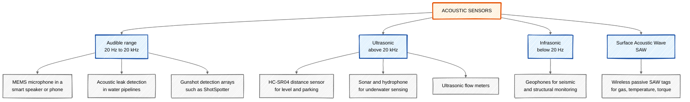

**Ultrasonic distance measurement.** The most common IoT use is the time of flight ranging sensor:

```math
d = \frac{v \times t}{2}, \qquad v_{\text{air}} \approx 343\ \text{m/s at } 20^{\circ}\text{C}
```

where $t$ is the total echo round trip time. The factor $2$ appears because the pulse travels to the target and back.

**IoT applications:** smart parking occupancy, tank and silo level measurement, voice assistants and keyword spotting, predictive maintenance by listening to bearing and motor noise, glass break detection in smart homes, non destructive testing of welds and pipes.

### B. Biosensors

**Definition.** A biosensor is an analytical device that combines a **biological recognition element**, called the bioreceptor, with a **physicochemical transducer**, so that the presence or concentration of a specific target substance, called the analyte, is converted into a measurable electrical signal.

### Block diagram

```mermaid
%%{init: {'look':'handDrawn', 'theme':'neutral'}}%%
flowchart LR
    A["<b>ANALYTE</b><br/>glucose, hCG, DNA,<br/>pathogen, pesticide"]:::an
    B["<b>BIORECEPTOR</b><br/>enzyme, antibody, DNA,<br/>cell, aptamer"]:::bio
    C["<b>TRANSDUCER</b><br/>electrochemical, optical,<br/>piezoelectric, thermal"]:::tr
    D["<b>SIGNAL PROCESSOR</b><br/>amplify, filter,<br/>convert to digital"]:::sp
    E["<b>DISPLAY / IoT NODE</b><br/>reading sent to<br/>phone or cloud"]:::dp

    A -->|"selective binding"| B
    B -->|"biochemical change"| C
    C -->|"raw electrical signal"| D
    D -->|"processed value"| E

    classDef an fill:#ffe0b2,stroke:#e65100,stroke-width:2px
    classDef bio fill:#c8e6c9,stroke:#1b5e20,stroke-width:2px
    classDef tr fill:#bbdefb,stroke:#0d47a1,stroke-width:2px
    classDef sp fill:#e1bee7,stroke:#4a148c,stroke-width:2px
    classDef dp fill:#fff9c4,stroke:#f57f17,stroke-width:2px
```

The key property of a biosensor is **selectivity**. The bioreceptor binds only to its target, so a glucose sensor ignores the hundreds of other chemicals present in blood.

### Classification

**By bioreceptor**

| Type | Recognition element | Example |
|---|---|---|
| Enzymatic | Enzyme such as glucose oxidase | Blood glucose meter |
| Immunosensor | Antibody or antigen | Pregnancy test, rapid antigen test |
| Genosensor | Single strand DNA probe | Genetic screening, pathogen identification |
| Whole cell or microbial | Living bacteria or yeast | BOD sensor for water quality |
| Aptamer based | Synthetic nucleic acid | Toxin and drug detection |

**By transducer**

| Type | Measured quantity | Example |
|---|---|---|
| Electrochemical, amperometric | Current | Glucometer strip |
| Electrochemical, potentiometric | Voltage or pH | Urea biosensor with ISFET |
| Optical | Light intensity, colour, SPR | Lateral flow test strip, SPR immunoassay |
| Piezoelectric | Resonant frequency shift | Quartz crystal microbalance for virus detection |
| Thermal or calorimetric | Heat of reaction | Enzyme thermistor |

### Worked example : the blood glucose meter

1. A drop of blood is placed on a disposable strip coated with **glucose oxidase**.
2. The enzyme oxidises glucose, releasing electrons at the electrode.
3. The **amperometric transducer** measures the resulting current, which is proportional to glucose concentration.
4. The meter converts the current into mg/dL and displays it, and a connected version publishes the reading to a phone using BLE.

```math
\text{Glucose} + \mathrm{O_2} \xrightarrow{\text{glucose oxidase}} \text{Gluconic acid} + \mathrm{H_2O_2}, \qquad I \propto [\text{Glucose}]
```

**Other examples:** pulse oximeter, ECG and EEG electrodes, continuous glucose monitors such as the Freestyle Libre, wearable sweat lactate and cortisol patches, breathalyser with an alcohol oxidase electrode, and pesticide detection in food using acetylcholinesterase.

**Desirable characteristics:** high selectivity and sensitivity, linear response over the useful range, fast response time, good reproducibility and stability, low cost and small size, and no or minimal sample preparation.

---

## 2. Define Sensors and Actuators

### Sensor

**Definition.** A sensor is an **input transducer** that detects a physical, chemical or biological property of its environment and converts it into a signal, usually electrical, that can be read, recorded or processed by an electronic system.

A sensor **measures** and produces data. It converts **energy from the physical world into an electrical signal**.

### Actuator

**Definition.** An actuator is an **output transducer** that accepts an electrical control signal and converts it into a physical action such as motion, force, heat, light or flow, thereby producing a change in the environment.

An actuator **acts** and consumes data. It converts **an electrical signal into physical energy**.

### Relationship in an IoT closed loop

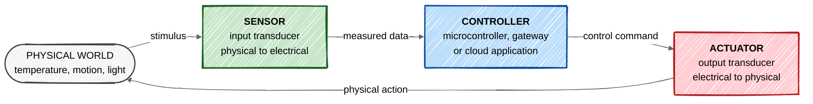

*Example of one full loop:* a DHT22 **sensor** reads 32 degrees Celsius, the **controller** compares it with the 24 degree setpoint, and it drives a relay **actuator** that switches on the air conditioner. The room cools, and the sensor reads the new value.

### Classification of sensors

| Basis | Categories |
|---|---|
| Power requirement | Active, needs an excitation source such as a thermistor or LVDT. Passive, self generating such as a thermocouple or piezo element |
| Output type | Analog such as LM35, or digital such as DHT22 and DS18B20 |
| Measured quantity | Thermal, mechanical, optical, magnetic, chemical, acoustic, biological |
| Contact | Contact such as a thermocouple, or non contact such as an IR or ultrasonic sensor |

### Classification of actuators

| Type | Energy source | Examples |
|---|---|---|
| Electrical | Electric current | Relay, solenoid, DC and stepper motor, servo |
| Hydraulic | Pressurised liquid | Hydraulic cylinder in excavators and presses |
| Pneumatic | Compressed air | Pneumatic valve and piston on assembly lines |
| Thermal | Heat | Shape memory alloy actuator, bimetallic strip |
| Magnetic | Magnetic field | Electromagnet, magnetic latch |
| Soft or smart material | Voltage on a special material | Piezoelectric stack, electroactive polymer |

### Comparison

| Parameter | Sensor | Actuator |
|---|---|---|
| Role | Detects and measures | Acts and changes |
| Direction | Input to the system | Output from the system |
| Conversion | Physical quantity to electrical signal | Electrical signal to physical quantity |
| Placement in signal chain | Front end, before processing | Back end, after processing |
| Energy | Consumes very little | Usually consumes significant power |
| IoT examples | LM35, MQ2 gas, PIR, accelerometer | Relay, servo motor, buzzer, solenoid valve |

Both are **transducers**, since a transducer is any device that converts energy from one form into another. Sensors and actuators are simply the input and output members of that family.

---

## 3. Link Layer Protocols

**Definition.** Link layer protocols determine how data is **physically transmitted over the network medium** and how frames are placed on and taken off that medium. They handle framing, physical or MAC addressing, medium access control and error detection, and they operate at the lowest level of the IoT protocol stack, giving devices their first hop of connectivity.

### Taxonomy of the common IoT link layer protocols

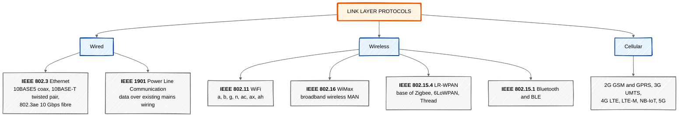

### Functions performed at the link layer

1. **Framing.** Divides the bit stream into frames with a header and trailer.
2. **Physical addressing.** Adds source and destination MAC addresses, 48 bits in Ethernet and WiFi, and 16 or 64 bits in IEEE 802.15.4.
3. **Medium access control.** Decides which node may transmit. Ethernet historically used CSMA/CD, WiFi uses CSMA/CA, and 802.15.4 uses slotted or unslotted CSMA/CA with optional guaranteed time slots.
4. **Error detection.** A CRC in the frame trailer lets the receiver discard corrupted frames.
5. **Flow control** between adjacent nodes.

### Detail of the important protocols

| Protocol | Standard | Band | Data rate | Range | Typical IoT use |
|---|---|---|---|---|---|
| Ethernet | IEEE 802.3 | Wired | 10 Mbps to 100 Gbps | 100 m per segment | Gateways, industrial PLCs, cameras |
| WiFi | IEEE 802.11 a/b/g/n/ac/ax | 2.4 and 5 GHz | 1 Mbps to several Gbps | 20 m to 100 m | Smart home devices, cameras, gateways |
| WiFi HaLow | IEEE 802.11ah | Sub 1 GHz | 150 kbps to 8 Mbps | Up to 1 km | Large sensor deployments, up to 8191 nodes per AP |
| WiMax | IEEE 802.16 | 2 to 66 GHz | Up to 100 Mbps | Several km | Wireless backhaul for IoT gateways |
| LR-WPAN | IEEE 802.15.4 | 2.4 GHz, 868 and 915 MHz | 250 kbps at 2.4 GHz | 10 m to 100 m | Zigbee, 6LoWPAN, Thread, WirelessHART |
| Bluetooth and BLE | IEEE 802.15.1 | 2.4 GHz | 1 to 3 Mbps, BLE 5 up to 2 Mbps | 10 m to 100 m | Wearables, beacons, medical devices |
| PLC | IEEE 1901 | Mains wiring | Up to 500 Mbps | Building wide | Smart meters, street lighting |
| Cellular | 3GPP | Licensed | 9.6 kbps in GPRS to Gbps in 5G | Kilometres | Vehicle tracking, remote assets |

### Why IEEE 802.15.4 matters most in IoT

It is the link layer that nearly every constrained IoT stack is built on:

```math
\text{PHY payload} \le 127 \text{ bytes} \;\Rightarrow\; \text{MAC payload} \approx 102 \text{ bytes} \;\Rightarrow\; \text{IPv6 needs } 6\text{LoWPAN compression}
```

An IPv6 header alone is 40 bytes and the minimum IPv6 MTU is 1280 bytes, so **6LoWPAN** must compress the header and fragment the packet before IPv6 can run over 802.15.4. This is why the adaptation layer exists.

---

## 4. MQTT and CoAP

Both are **application layer messaging protocols designed for constrained IoT devices**, but they follow opposite models. MQTT is publish and subscribe over TCP, while CoAP is request and response over UDP.

---

### A. MQTT : Message Queuing Telemetry Transport

**Definition.** MQTT is a lightweight **publish and subscribe** messaging protocol developed by IBM in 1999 and standardised by OASIS. Clients never talk to each other directly. All messages pass through a central server called the **broker**, and they are filed under hierarchical strings called **topics**.

| Property | Value |
|---|---|
| Model | Publish and subscribe, many to many |
| Transport | TCP, so delivery is reliable and ordered |
| Default port | 1883 plain, 8883 over TLS |
| Fixed header | 2 bytes minimum |
| Security | TLS with username and password or certificates |
| Standard | OASIS MQTT 3.1.1 and MQTT 5.0 |

### Architecture

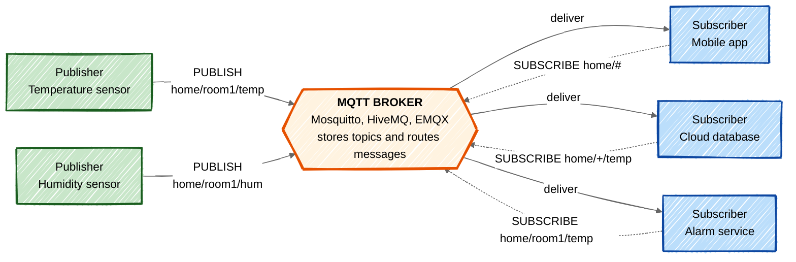

**Topic wildcards.** `+` matches exactly one level, so `home/+/temp` matches `home/room1/temp` and `home/room2/temp`. `#` matches all remaining levels, so `home/#` matches everything under `home`.

### Quality of Service levels

| QoS | Name | Guarantee | Handshake |
|---|---|---|---|
| 0 | At most once, fire and forget | May be lost, never duplicated | PUBLISH only |
| 1 | At least once | Always delivered, may be duplicated | PUBLISH then PUBACK |
| 2 | Exactly once | Delivered exactly one time | PUBLISH, PUBREC, PUBREL, PUBCOMP |

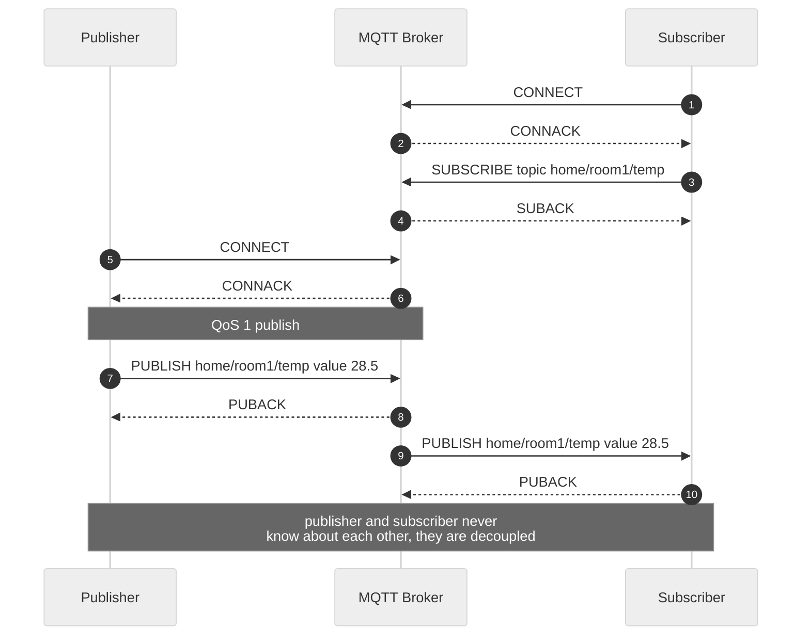

### Special MQTT features

- **Retained message.** The broker keeps the last message on a topic, so a new subscriber gets the current value immediately instead of waiting for the next publish.
- **Last Will and Testament.** A client registers a message at connect time that the broker publishes automatically if the client disconnects ungracefully, which gives instant device offline detection.
- **Persistent session.** With the clean session flag off, the broker queues messages for a subscriber that is temporarily offline.
- **Keep alive.** Periodic PINGREQ and PINGRESP confirm the connection is alive.

---

### B. CoAP : Constrained Application Protocol

**Definition.** CoAP, defined in RFC 7252 by the IETF, is a specialised **web transfer protocol** for constrained nodes and constrained networks. It is essentially a very small and efficient version of HTTP that runs over UDP and follows the **REST** model, so resources are addressed by URIs and manipulated with GET, POST, PUT and DELETE.

| Property | Value |
|---|---|
| Model | Request and response, client and server, RESTful |
| Transport | UDP, so it is connectionless and low overhead |
| Default port | 5683 plain, 5684 over DTLS |
| Header | 4 bytes fixed |
| Reliability | Optional, provided by CoAP itself using confirmable messages |
| Security | DTLS |

### Two sublayers

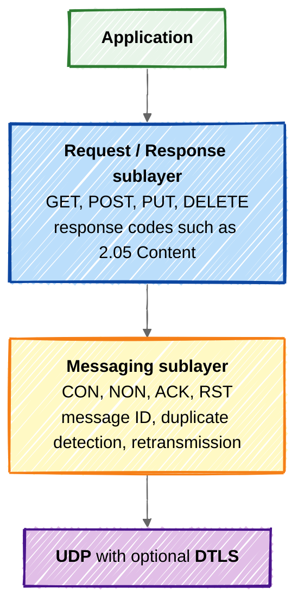

### Message types

| Type | Meaning | Behaviour |
|---|---|---|
| CON, Confirmable | Requires acknowledgement | Retransmitted with exponential backoff until an ACK arrives |
| NON, Non confirmable | No acknowledgement needed | Sent once, used for repetitive sensor readings |
| ACK, Acknowledgement | Confirms a CON message | May carry the response piggybacked |
| RST, Reset | Message received but could not be processed | Signals an error or an unknown context |

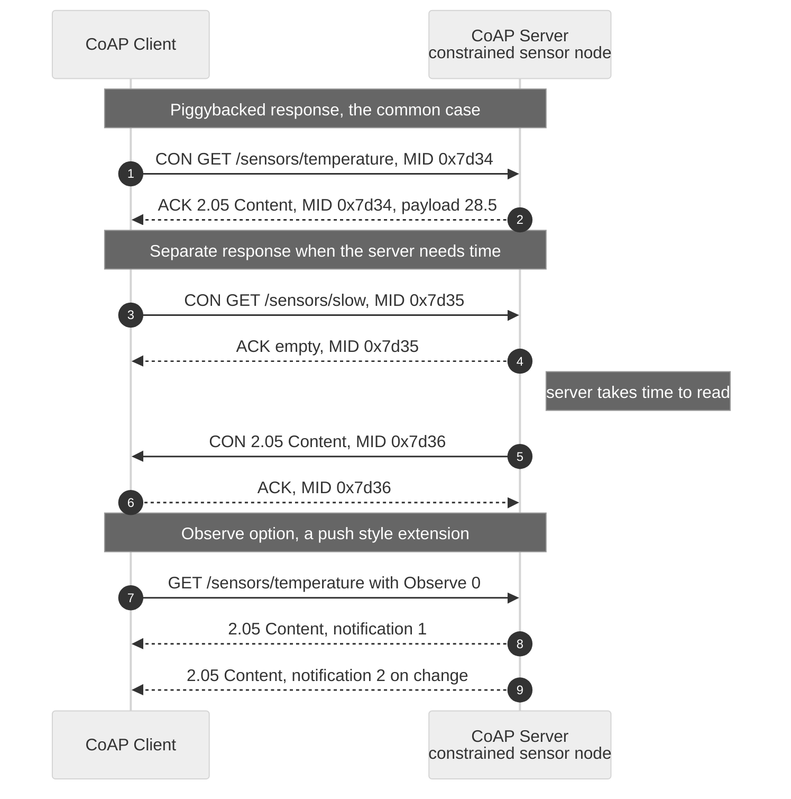

### Special CoAP features

- **Observe option, RFC 7641.** A client registers interest once, and the server pushes a notification whenever the resource changes. This gives publish and subscribe behaviour without a broker.
- **Resource discovery.** A GET on `/.well-known/core` returns the list of resources the server offers.
- **Block wise transfer, RFC 7959.** Large payloads are split into blocks so they fit inside constrained frames.
- **Proxy and caching.** Responses carry a Max-Age option, so a proxy can serve cached data and let the sensor sleep.
- **HTTP mapping.** A CoAP to HTTP proxy lets ordinary web applications reach constrained devices.

---

### C. Comparison of MQTT and CoAP

| Parameter | MQTT | CoAP |
|---|---|---|
| Communication model | Publish and subscribe | Request and response, RESTful |
| Architecture | Broker based, client to broker | Direct client to server, no broker |
| Transport protocol | TCP | UDP |
| Default port | 1883, and 8883 with TLS | 5683, and 5684 with DTLS |
| Header size | 2 bytes minimum | 4 bytes fixed |
| Reliability | Provided by TCP plus three QoS levels | Provided by CoAP itself using CON messages |
| Security | TLS or SSL | DTLS |
| Messaging pattern | One to many and many to many | Mainly one to one |
| Multicast support | Not supported | Supported over UDP |
| Coupling | Publisher and subscriber are decoupled | Client and server are tightly coupled |
| Power and bandwidth use | Slightly higher because of the TCP session | Lower, since UDP is connectionless |
| Discovery | Not built in | Built in through `/.well-known/core` |
| Best suited for | Telemetry from many devices to the cloud, unreliable links, event driven data | Constrained devices, local networks, direct resource query and control |
| Typical use case | Smart home hubs, vehicle telemetry, industrial dashboards | Smart lighting and metering, 6LoWPAN sensor networks |

**Which to choose.** Use MQTT when many consumers need the same stream, when devices sleep and reconnect often, or when the link is unreliable. Use CoAP when a device is severely constrained, when the interaction is a direct query or command on a specific resource, or when the network already speaks IPv6 and 6LoWPAN.

---

## 5. Access Technologies : WPAN, WLAN, WHAN, LPWA

An **access technology** is the first hop wireless technology that connects a smart object to the network. IoT access networks are classified by the **geographic range** they cover.


### A. WPAN : Wireless Personal Area Network

Very short range, low power, around a person or a single machine.

| Technology | Standard | Band | Data rate | Range | Notes |
|---|---|---|---|---|---|
| Bluetooth Classic | IEEE 802.15.1 | 2.4 GHz | 1 to 3 Mbps | 10 to 100 m | Audio, point to point |
| Bluetooth Low Energy | Bluetooth 4.x and 5.x | 2.4 GHz | 1 to 2 Mbps | 10 to 240 m | Wearables, beacons, BLE Mesh |
| Zigbee | IEEE 802.15.4 | 2.4 GHz, 868 and 915 MHz | 250 kbps | 10 to 100 m | Mesh, very low power |
| 6LoWPAN | IEEE 802.15.4 plus RFC 4944 | Same as above | 250 kbps | 10 to 100 m | Carries IPv6 over 802.15.4 |
| Thread | IEEE 802.15.4 plus IPv6 | 2.4 GHz | 250 kbps | 10 to 30 m | Self healing mesh, basis of Matter |
| NFC | ISO 14443 and 18092 | 13.56 MHz | up to 424 kbps | under 10 cm | Payments, pairing, tags |
| RFID | ISO 18000 | LF 125 kHz, HF 13.56 MHz, UHF 860 to 960 MHz | Varies | cm to 10 m | Asset tracking, passive tags |
| WirelessHART and ISA100.11a | IEEE 802.15.4 | 2.4 GHz | 250 kbps | 10 to 100 m | Industrial process control |

### B. WLAN : Wireless Local Area Network

Covers a building, campus or factory floor.

| Technology | Standard | Band | Data rate | Range |
|---|---|---|---|---|
| WiFi 4 | IEEE 802.11n | 2.4 and 5 GHz | up to 600 Mbps | 70 m indoor |
| WiFi 5 | IEEE 802.11ac | 5 GHz | up to about 3.5 Gbps | 35 m indoor |
| WiFi 6 and 6E | IEEE 802.11ax | 2.4, 5 and 6 GHz | up to about 9.6 Gbps | 30 to 70 m |
| WiFi HaLow | IEEE 802.11ah | Sub 1 GHz | 150 kbps to 8 Mbps | up to 1 km |
| WiFi for vehicles | IEEE 802.11p, DSRC | 5.9 GHz | up to 27 Mbps | up to 1 km |

**802.11ah HaLow** is the variant designed for IoT. It uses sub gigahertz frequencies for better wall penetration, supports up to **8191 stations per access point**, and adds power saving features such as Target Wake Time and Restricted Access Window.

### C. WHAN : Wireless Home Area Network

A subset of WPAN and WLAN dedicated to home automation, energy management and comfort.

| Technology | Band | Topology | Typical use |
|---|---|---|---|
| Zigbee Home Automation and Zigbee Green Power | 2.4 GHz | Mesh | Lights, sensors, smart plugs |
| Z-Wave | 868.42 MHz in EU and 908.42 MHz in US | Mesh, up to 232 nodes | Locks, blinds, thermostats |
| Thread and Matter | 2.4 GHz | IPv6 mesh, no single point of failure | Modern interoperable smart home |
| Bluetooth Mesh | 2.4 GHz | Managed flooding mesh | Lighting control |
| WiFi | 2.4 and 5 GHz | Star through the home router | Cameras, speakers, TVs |
| EnOcean | 868 MHz | Star and repeater | Battery free switches using energy harvesting |
| Insteon and KNX-RF | Sub 1 GHz | Dual mesh, RF plus power line | Whole house wired and wireless control |

### D. LPWA : Low Power Wide Area

Long range, very low data rate, and battery life measured in years. Designed for devices that send a few bytes occasionally.

| Technology | Type | Band | Data rate | Range | Battery life |
|---|---|---|---|---|---|
| LoRaWAN | Unlicensed, chirp spread spectrum | 868 MHz EU, 915 MHz US, 865 to 867 MHz India | 0.3 to 50 kbps | 5 km urban, up to 15 km rural | up to 10 years |
| Sigfox | Unlicensed, ultra narrow band | Sub 1 GHz ISM | about 100 bps | 10 km urban, up to 50 km rural | up to 10 years |
| NB-IoT | Licensed 3GPP | LTE in band, guard band or standalone, 180 kHz | tens of kbps, peak about 250 kbps | up to 15 km | up to 10 years |
| LTE-M, Cat-M1 | Licensed 3GPP | LTE, 1.4 MHz | up to about 1 Mbps | up to 11 km | up to 10 years |
| EC-GSM-IoT | Licensed 3GPP | GSM bands | up to about 240 kbps | up to 15 km | up to 10 years |
| Ingenu RPMA | Unlicensed | 2.4 GHz | up to 624 kbps | up to 15 km | several years |
| Wi-SUN and DASH7 | Unlicensed | Sub 1 GHz | 50 to 300 kbps | 1 to 5 km | several years |

**LoRaWAN device classes**

| Class | Downlink behaviour | Power | Use |
|---|---|---|---|
| A | Two short receive windows only after an uplink | Lowest | Battery sensors, the default |
| B | Extra scheduled receive slots synchronised by beacons | Medium | Devices needing predictable downlink |
| C | Receiver almost always open | Highest | Mains powered actuators |

### Summary : choosing an access technology

| Requirement | Best fit |
|---|---|
| Very short range, very low power, mesh | Zigbee, Thread, BLE, that is WPAN |
| High bandwidth video or audio in a building | WiFi, that is WLAN |
| Home automation with interoperability | Thread and Matter, Zigbee, Z-Wave, that is WHAN |
| A few bytes per day over kilometres on a battery | LoRaWAN, Sigfox, NB-IoT, that is LPWA |
| Guaranteed quality of service and licensed spectrum | NB-IoT or LTE-M |
| Contactless identification | NFC or RFID |

---

## 6. Analytics and Control Applications in the Applications Layer

The **Applications and Analytics Layer** is the topmost layer of the **IoT Core Functional Stack**. The lower two layers, Things and Communications Network, only move raw data. This layer is where that data finally becomes **useful information and useful action**. It contains two broad families of applications.

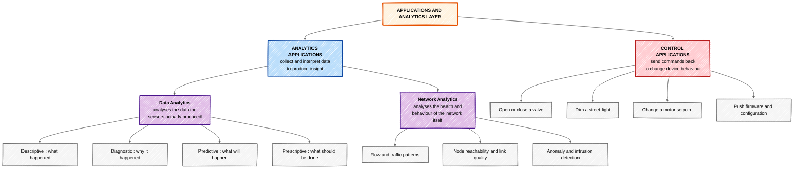

### A. Analytics Applications

Analytics applications **collect data from many smart objects and process it to extract insight**. They are read oriented. Cisco divides them into two distinct types.

**1. Data Analytics.** Processes the actual measurements the sensors produced, in order to answer a business question.

| Level | Question answered | Method | IoT example |
|---|---|---|---|
| Descriptive | What happened | Aggregation, dashboards, reporting | Average energy consumed per floor last month |
| Diagnostic | Why did it happen | Correlation, root cause analysis | The chiller tripped because inlet pressure spiked |
| Predictive | What is likely to happen | Machine learning on historical data | This bearing will fail in about 300 operating hours |
| Prescriptive | What action should be taken | Optimisation and rules on top of prediction | Schedule the bearing replacement during the Sunday shutdown |

**2. Network Analytics.** Processes data about **the network itself** rather than about the physical process. It answers questions such as which nodes have gone silent, where traffic is congested, whether link quality is degrading, and whether traffic patterns look like an attack. This matters enormously in IoT because a sensor network may contain tens of thousands of constrained nodes that cannot report their own health reliably.

**Why network analytics is a separate discipline in IoT**

- A silent node may mean a dead battery, a broken link, or a genuine absence of events, and only network analytics can tell these apart.
- Detecting an abnormal traffic pattern early prevents a compromised device from becoming part of a botnet, as happened in the Mirai attack.
- Capacity planning for a constrained LPWA network depends on measured duty cycle, not on assumptions.

**Where analytics runs.** Analytics is distributed across the compute stack. Simple filtering and thresholding runs at the **edge or fog** for immediate response, while heavy model training and long term trend analysis runs in the **cloud**.

### B. Control Applications

Control applications **send commands and configuration back down to the smart objects**. They are write oriented, and they close the loop that analytics opens.

| Function | Description | Example |
|---|---|---|
| Actuation | Directly command an actuator | Close a valve when a gas leak is detected |
| Setpoint management | Change the target a local controller works towards | Raise a chiller setpoint by two degrees during peak tariff hours |
| Scheduling | Time based operation | Dim street lights to 40 percent after midnight |
| Firmware and configuration management | Push updates over the air | Distribute a security patch to 50000 meters |
| Safety interlock | Immediate protective action | Stop a conveyor when a proximity sensor is triggered |

**Critical design requirement.** Control applications are **latency and reliability sensitive** in a way that analytics applications are not. A dashboard can tolerate a delay of several seconds, but an emergency shutdown cannot. For this reason time critical control is placed at the **edge or fog**, close to the machine, while non critical control such as a lighting schedule may safely run in the cloud.

### How the two work together

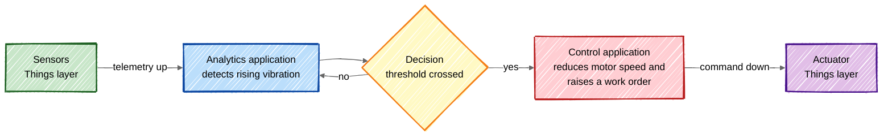

Analytics answers **what is happening and what will happen**. Control decides **what to do about it**. Together they form the feedback loop that makes an IoT system autonomous rather than merely instrumented.

---

## 7. Communications Network Layer in IoT

The **Communications Network Layer** is the **second layer of the IoT Core Functional Stack**. It sits between the Things layer below and the Applications and Analytics layer above, and its job is to carry data from constrained smart objects all the way to the applications that consume it.

The problem it solves is difficult, because the two ends are very unlike each other. At the bottom there may be a battery powered node with 10 KB of RAM speaking IEEE 802.15.4, and at the top an enterprise data centre speaking IP over fibre. This layer bridges that gap, and it is therefore split into **four sublayers**.

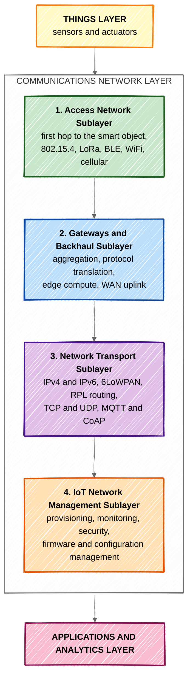

### Sublayer 1 : Access Network

The **first hop** between the smart object and the rest of the network. Choosing it is the single most consequential design decision in an IoT deployment, because it fixes range, data rate, battery life and cost all at once.

Selection criteria: **range, frequency band, power consumption, topology, number of devices supported, data rate and payload size, and deployment cost**.

| Range class | Technologies |
|---|---|
| WPAN, up to about 10 m | BLE, Zigbee, 802.15.4, NFC, RFID |
| WHAN, one dwelling | Zigbee, Z-Wave, Thread, EnOcean |
| WLAN, up to about 100 m | WiFi 802.11 a/b/g/n/ac/ax and 802.11ah |
| WFAN, field area | 802.15.4g, Wi-SUN, power line communication |
| LPWA and WWAN, kilometres | LoRaWAN, Sigfox, NB-IoT, LTE-M, 5G |

**Constraints imposed by the access network.** IEEE 802.15.4 caps the PHY payload at 127 bytes and Sigfox at 12 bytes per uplink. These limits directly force header compression and fragmentation higher up the stack.

### Sublayer 2 : Gateways and Backhaul Network

Access networks are short range, so their traffic must be **aggregated by a gateway** and carried over a **backhaul** to the data centre or cloud. This sublayer is covered in detail in [Question 8](#8-gateway-and-backhaul-network).

### Sublayer 3 : Network Transport

Provides the **end to end path**, so that a sensor reading can travel from a constrained node to an application regardless of the technologies in between. Its responsibilities are addressing, routing, transport and messaging.

| Function | Protocols used |
|---|---|
| Network addressing | IPv4 and IPv6, with IPv6 strongly preferred for its address space |
| Adaptation for constrained links | 6LoWPAN, which compresses the IPv6 header and fragments packets to fit in 127 bytes |
| Routing in lossy networks | RPL, the IPv6 Routing Protocol for Low Power and Lossy Networks, which builds a DODAG |
| Transport | UDP for constrained and tolerant traffic, TCP where reliability and ordering are required |
| Messaging | MQTT, CoAP, AMQP, XMPP, HTTP and REST |
| Security | DTLS over UDP and TLS over TCP |

**Why IPv6.** Address exhaustion in IPv4 makes it unusable at IoT scale:

```math
\text{IPv4} : 2^{32} \approx 4.3 \times 10^{9} \text{ addresses}
```
```math
\text{IPv6} : 2^{128} \approx 3.4 \times 10^{38} \text{ addresses}
```

IPv6 also brings stateless address autoconfiguration, which removes the need to configure thousands of nodes by hand.

### Sublayer 4 : IoT Network Management

Handles everything needed to **operate a network of thousands or millions of constrained devices** over its lifetime. The traditional tools of enterprise networking do not scale here, because a node may be asleep for hours and may never be physically reachable again.

| Function | Description |
|---|---|
| Provisioning and onboarding | Bringing a new device into the network with an identity and credentials |
| Monitoring | Tracking node reachability, battery level, link quality and duty cycle |
| Configuration management | Changing reporting intervals and thresholds remotely |
| Firmware update over the air | Distributing patches without physical access |
| Security management | Key distribution, certificate rotation, authentication and revocation |
| Fault and performance management | Detecting failures and degradation before they affect the application |

Protocols used include **SNMP**, **NETCONF and YANG**, **LwM2M** from the Open Mobile Alliance, and **TR-069**. **LwM2M** is the one designed specifically for constrained devices, as it runs over CoAP and DTLS.

### Summary of responsibilities

| Sublayer | Core question it answers |
|---|---|
| Access Network | How does the device get its first hop of connectivity |
| Gateways and Backhaul | How is that traffic aggregated and carried to the core |
| Network Transport | How does a packet travel end to end and reach the right application |
| IoT Network Management | How is the whole network operated, secured and updated over its life |

---

## 8. Gateway and Backhaul Network

This is the **second sublayer of the Communications Network Layer**. It exists because the access network and the core network are fundamentally incompatible, and something must sit between them.

**The core problem.** An access network such as 802.15.4 or LoRa is short range, low bandwidth, non IP and often proprietary. The core network is long range, high bandwidth, IP based and standardised. The gateway is the point of translation, and the backhaul is the long distance path that carries the aggregated traffic.

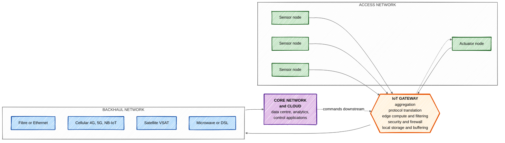

### A. The IoT Gateway

**Definition.** A gateway is a device that interconnects the constrained access network with the backhaul and core network, performing **protocol translation, data aggregation, local processing and security enforcement** at the boundary between the two.

### Functions of a gateway

| Function | Description |
|---|---|
| **Aggregation** | Collects traffic from hundreds or thousands of nodes and combines it into a smaller number of upstream flows |
| **Protocol translation** | Converts between the access protocol and the core protocol, for example Modbus or Zigbee to MQTT over IP, or CoAP to HTTP |
| **Media conversion** | Bridges different physical media, such as 802.15.4 radio to Ethernet or fibre |
| **Edge or fog computing** | Filters, aggregates and analyses data locally, so only useful information travels upstream |
| **Data buffering and store and forward** | Holds data when the backhaul is down, and forwards it when the link returns |
| **Security enforcement** | Acts as a firewall, terminates encryption, authenticates devices, and isolates the constrained network from the internet |
| **Device management** | Onboards nodes, distributes keys, and pushes firmware to the devices behind it |
| **Addressing and NAT** | Maps non IP or private addresses to routable addresses |
| **Time synchronisation** | Provides a common clock reference to the access network |

**Why the gateway is essential.** A constrained node cannot run TLS, cannot hold a routing table, cannot reach the public internet safely, and cannot afford to transmit every raw sample. The gateway does all of this on its behalf.

**Bandwidth reduction through edge filtering.** If 1000 sensors each sample once per second but the gateway forwards only a one minute average:

```math
\text{Raw upstream rate} = 1000 \times 1 = 1000 \text{ messages per second}
```
```math
\text{After aggregation} = \frac{1000}{60} \approx 16.7 \text{ messages per second}
```
```math
\text{Reduction} = \left(1 - \frac{1}{60}\right) \times 100 \approx 98.3\%
```

This single function often decides whether a deployment is economically viable, because backhaul bandwidth is usually the recurring cost.

### Types of gateway

| Type | Description | Example |
|---|---|---|
| Protocol gateway | Pure translation between two protocols | Modbus RTU to MQTT bridge |
| Edge gateway | Translation plus local compute and analytics | Cisco IR829 industrial router with fog capability |
| Cloud gateway | Ingestion endpoint in the cloud | AWS IoT Core, Azure IoT Hub |
| Field or concentrator gateway | Aggregates a large field area network | LoRaWAN gateway, smart meter data concentrator |

### B. The Backhaul Network

**Definition.** The backhaul is the **intermediate transport network** that carries aggregated traffic from the gateway to the core network, data centre or cloud. It is the long distance middle mile of the IoT path.

### Backhaul technology options

| Technology | Bandwidth | Latency | Best suited to | Limitation |
|---|---|---|---|---|
| Fibre optic and Ethernet | Very high, Gbps | Very low | Factories, campuses, urban deployments | Needs physical cable, high installation cost |
| Cellular 4G, 5G, LTE-M, NB-IoT | Medium to high | Low | Mobile assets, remote sites, quick rollout | Recurring data cost, coverage gaps |
| Satellite VSAT | Low to medium | Very high, 500 ms or more | Ships, pipelines, mining, deserts | Expensive, weather sensitive, high latency |
| Microwave point to point | High | Low | Line of sight links between towers | Requires clear line of sight |
| DSL and cable | Medium | Low | Small commercial and residential gateways | Distance dependent, asymmetric |
| Power Line Communication | Low to medium | Medium | Smart grid and street lighting where mains already exists | Noisy, distance limited |
| WiMax and 802.11 point to point | Medium | Low | Rural and campus wireless bridging | Interference in unlicensed bands |

### Requirements the backhaul must satisfy

1. **Sufficient bandwidth** for the aggregated load, with headroom for firmware updates that are far larger than telemetry.
2. **Acceptable latency**, particularly if any control loop is closed through the cloud.
3. **Availability and redundancy**, often a primary fibre link with a cellular failover.
4. **Security**, usually an encrypted tunnel such as IPsec or a private APN.
5. **Cost efficiency**, since the backhaul is the recurring operational expense.
6. **Scalability**, since a deployment that starts with 100 nodes may grow to 100000.

### Design consideration

There is a direct engineering trade off between the gateway and the backhaul. **The more processing done at the gateway, the less backhaul capacity is required.** A gateway that only relays raw frames needs an expensive high bandwidth link, while a gateway that filters, compresses and summarises can run comfortably over NB-IoT. This is exactly the argument for edge and fog computing developed in [Question 13](#13-advantages-of-edge-and-fog-computing).

---

## 9. Request Response Communication Model

**Definition.** The request response model is a **stateless client server** communication model in which the client sends a request for a resource to the server, the server processes the request, retrieves the resource, prepares a response and sends it back to the client. Each request is handled **independently** of every other request.

### Key properties

| Property | Explanation |
|---|---|
| Stateless | The server keeps no memory of previous requests, so each request must carry all the information needed to service it |
| Client driven, pull based | Communication starts only when the client asks, and the server never initiates |
| Synchronous | The client normally waits for the response before continuing |
| One to one | Exactly one client and one server per exchange |
| Tightly coupled | The client must know the address and the resource identifier of the server |

### Diagram

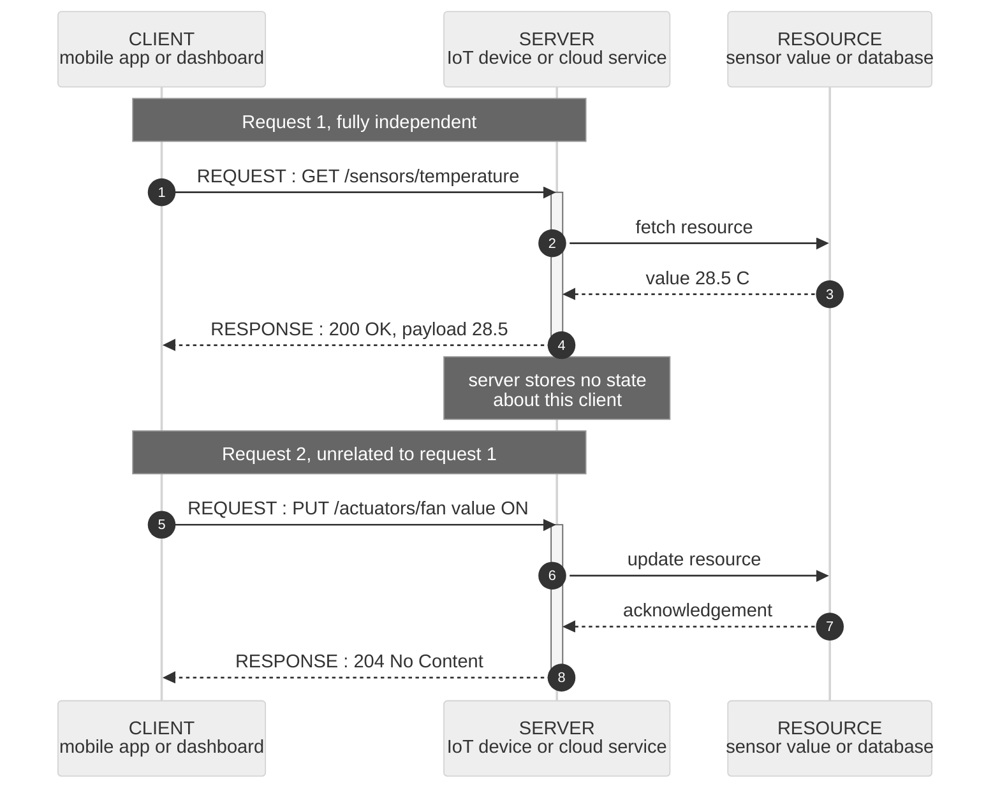

### Block view

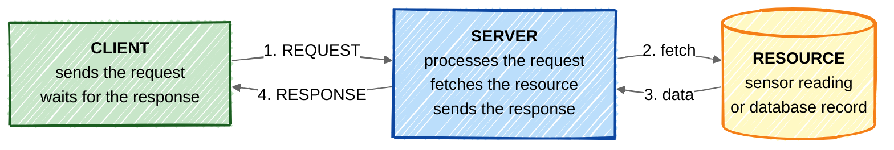

### Protocols that use this model

**HTTP and REST** and **CoAP** are the primary examples. The operations map directly onto CRUD:

| Method | Action | Example |
|---|---|---|
| GET | Read a resource | `GET coap://node1/sensors/temp` |
| POST | Create a resource or trigger an action | `POST /devices` to register a new node |
| PUT | Update or replace a resource | `PUT /actuators/valve` with value CLOSED |
| DELETE | Remove a resource | `DELETE /devices/node42` |

### Advantages

- **Simple and universally understood**, since it is the model of the entire web.
- **Statelessness makes servers easy to scale**, because any server instance can handle any request.
- **Well defined semantics** through standard methods and response codes.
- **Direct control**, since the client knows exactly when it asked and what it received.
- **Caching is straightforward**, using Max-Age in CoAP or Cache-Control in HTTP.

### Disadvantages

- **Not suitable for real time or event driven data.** The server cannot notify the client when something changes, so the client must poll, which wastes battery and bandwidth.
- **Tight coupling** between client and server.
- **Poor fit for one to many distribution**, since each client must request separately.
- **Latency and overhead** grow when a device must be polled frequently.

### Where it fits, and the alternatives

| Model | Direction | Coupling | Best used for |
|---|---|---|---|
| **Request response** | Client pulls | Tight | On demand query, direct command, configuration read |
| Publish subscribe | Broker pushes to subscribers | Loose | Telemetry streams to many consumers |
| Push pull | Producers push to a queue, consumers pull | Loose | Buffering bursty data, decoupling rates |
| Exclusive pair | Persistent bidirectional connection | Tight, stateful | Continuous two way sessions such as WebSocket |

**In practice both models coexist in one IoT system.** A dashboard uses request response to read a device configuration on demand, while the same device streams its telemetry through MQTT publish subscribe. CoAP bridges the two through its Observe option, which layers a push notification onto an otherwise request response protocol.

---

## 10. Characteristics of IoT

The Internet of Things is defined by a set of properties that distinguish it from ordinary computer networking. The following are the essential characteristics.

```mermaid
%%{init: {'look':'handDrawn', 'theme':'neutral'}}%%
flowchart TD
    IOT(("<b>IoT</b>")):::root
    IOT --> C1["Dynamic and<br/>Self Adapting"]:::c
    IOT --> C2["Self Configuring"]:::c
    IOT --> C3["Interoperable<br/>Communication Protocols"]:::c
    IOT --> C4["Unique Identity"]:::c
    IOT --> C5["Integrated into<br/>Information Network"]:::c
    IOT --> C6["Heterogeneity"]:::c
    IOT --> C7["Connectivity"]:::c
    IOT --> C8["Sensing and Actuation"]:::c
    IOT --> C9["Massive Scale"]:::c
    IOT --> C10["Intelligence"]:::c
    IOT --> C11["Energy and Resource<br/>Constraints"]:::c
    IOT --> C12["Safety, Security<br/>and Privacy"]:::c

    classDef root fill:#fff3e0,stroke:#e65100,stroke-width:3px
    classDef c fill:#e3f2fd,stroke:#0d47a1,stroke-width:2px
```

### 1. Dynamic and Self Adapting

IoT devices must **change their behaviour automatically in response to changing context**, sensed conditions, operating environment or user action. A surveillance camera adapts its mode based on whether it is day or night, and it switches to a higher frame rate when motion is detected. A thermostat learns occupancy patterns and adjusts its schedule without being reprogrammed.

### 2. Self Configuring

A large number of devices must be able to **work together to provide a service with minimal human intervention**. Devices can configure themselves, set up networking, and fetch the latest software updates on their own. A new Zigbee bulb joins the mesh, receives its network key and announces its capabilities without the user editing any configuration file.

### 3. Interoperable Communication Protocols

Devices from **different manufacturers must interoperate**, so they support standard protocols rather than proprietary ones. This is why standards such as IEEE 802.15.4, 6LoWPAN, MQTT, CoAP, Thread and Matter exist. Without interoperability, an IoT deployment fragments into isolated silos.

### 4. Unique Identity

Every device has a **unique identifier**, such as an IP address, an IPv6 address, a MAC address, an EPC on an RFID tag, or a device certificate. It also has a unique interface, typically a web or REST endpoint, through which it can be queried, monitored and controlled.

```math
\text{IPv6 gives } 2^{128} \approx 3.4 \times 10^{38} \text{ addresses, enough for every object on Earth}
```

### 5. Integrated into the Information Network

IoT devices are **integrated with the wider information network**, so they can exchange data with other devices and systems. They describe themselves to other devices, and the network becomes more intelligent as devices join and collaborate. This is what turns isolated sensors into a system.

### 6. Heterogeneity

IoT devices differ enormously in **hardware platform, operating system, network technology, power source and capability**. A deployment may contain an 8 bit microcontroller on a coin cell alongside a Linux gateway on mains power. The architecture must accommodate this diversity, which is why adaptation layers and gateways are so central.

### 7. Connectivity

Connectivity enables **network accessibility and compatibility**. Accessibility means being reachable on the network, and compatibility means the ability to consume and produce data in a common form. Connectivity may be intermittent, since a device may sleep for hours to conserve energy.

### 8. Sensing and Actuation

IoT devices **sense the physical environment and act upon it**. This is the property that distinguishes IoT from ordinary computing, because IoT systems have a direct physical footprint. Sensing gives awareness of the analog world, and actuation closes the loop.

### 9. Massive Scale

The number of devices is orders of magnitude larger than the number of computers on the traditional internet, and the volume of data generated is larger still. This forces new designs for addressing, management and analytics, because manual per device administration is impossible.

### 10. Intelligence

Devices and the systems around them extract **knowledge from raw data** using analytics and machine learning. Intelligence is distributed, with simple decisions taken at the edge for low latency and complex modelling performed in the cloud.

### 11. Energy and Resource Constraints

Most IoT nodes run on **batteries or harvested energy**, with severely limited memory and processing power. The RFC 7228 classification captures this:

| Class | RAM | Flash or ROM |
|---|---|---|
| Class 0 | much less than 10 KB | much less than 100 KB |
| Class 1 | about 10 KB | about 100 KB |
| Class 2 | about 50 KB | about 250 KB |

| Power strategy | Meaning |
|---|---|
| P0, normally off | Wakes only to transmit, then sleeps |
| P1, low power | Duty cycled operation |
| P9, always on | Mains powered, no energy constraint |

Every protocol decision in IoT, from short headers to sleepy node support, follows from this constraint.

### 12. Safety, Security and Privacy

Because IoT acts on the physical world, a failure or a breach can cause **physical harm and not merely data loss**. Security must cover device identity, data confidentiality in transit and at rest, secure boot and firmware signing, and network segmentation. Privacy matters because IoT data is often personal, such as occupancy, location and health.

### Summary

| Characteristic | One line description |
|---|---|
| Dynamic and self adapting | Behaviour changes automatically with context |
| Self configuring | Devices set themselves up with minimal human effort |
| Interoperable protocols | Standards allow multi vendor devices to work together |
| Unique identity | Every device is uniquely addressable and reachable |
| Integrated into the network | Devices collaborate rather than operate in isolation |
| Heterogeneity | Widely differing hardware, software and networks coexist |
| Connectivity | Accessible and compatible on the network, possibly intermittently |
| Sensing and actuation | Direct interaction with the physical world |
| Massive scale | Billions of devices and enormous data volume |
| Intelligence | Analytics turns data into decisions |
| Energy constrained | Battery and resource limits drive all design choices |
| Secure and safe | Breaches have physical, not only digital, consequences |

---

## 11. Things Layer in the Simplified IoT Architecture

### The Simplified IoT Architecture

Cisco presents the Simplified IoT Architecture as **two parallel and interdependent stacks**. The **Core IoT Functional Stack** describes how data moves and how devices are connected, and the **IoT Data Management and Compute Stack** describes where data is stored and processed. The **Things layer is the foundation of the functional stack** and the source of everything that happens above it.

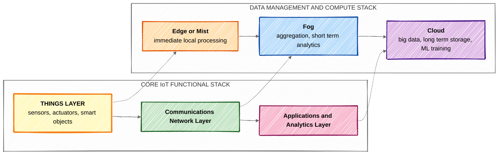

### Definition of the Things layer

The Things layer, also called the **smart objects layer**, is the **lowest layer of the IoT Core Functional Stack**. It consists of the physical devices, that is the sensors, actuators and smart objects, that interact directly with the physical environment. It converts real world phenomena into digital data and converts digital commands back into physical action.

### The four components of a smart object

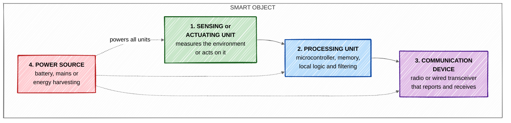

| Component | Role | Constraint it imposes |
|---|---|---|
| Sensing or actuating unit | The interface to the physical world | Determines accuracy, sampling rate and calibration needs |
| Processing unit | Executes local logic, filtering and encryption | Typically only kilobytes of RAM, so protocols must be tiny |
| Communication device | Sends readings and receives commands | The radio dominates energy consumption, so transmissions must be rare and short |
| Power source | Supplies all of the above | Battery capacity sets the deployment lifetime |

**The dominant design fact.** The radio consumes far more energy than computation, which is why edge filtering, short headers and sleepy node operation are universal in IoT.

### Characteristics of the Things layer

1. **Constrained.** Limited processing, memory, bandwidth and energy.
2. **Heterogeneous.** Ranges from a passive RFID tag to a full Linux industrial controller.
3. **Massive in number.** Thousands to millions of devices in a single deployment.
4. **Often unattended.** Deployed in locations that are hard or impossible to reach again.
5. **Uniquely identifiable.** Every object has an identity so it can be addressed and secured.
6. **Frequently mobile.** Assets, vehicles and wearables move between coverage areas.
7. **Physically exposed.** Harsh environments and the risk of physical tampering.

### Classification of smart objects

**By energy limitation, RFC 7228**

| Class | Meaning |
|---|---|
| E0 | Energy limited per event, for example an energy harvesting switch |
| E1 | Energy limited per period, recharged in cycles |
| E2 | Energy limited for the lifetime, a non replaceable battery |
| E9 | No direct quantitative energy limitation, mains powered |

**By power strategy**

| Class | Behaviour | Example |
|---|---|---|
| P0 | Normally off, wakes briefly to send | RFID tag, door sensor |
| P1 | Low power, duty cycled | LoRa soil moisture sensor |
| P9 | Always on | Video camera, industrial gateway |

**By function**

| Type | Description | Example |
|---|---|---|
| Sensor node | Measures only | Temperature, humidity, PIR, gas |
| Actuator node | Acts only | Relay, valve, motor, lamp |
| Combined node | Both senses and acts | Smart thermostat, smart lock |
| Tag | Identifies passively | RFID and NFC tags |
| Gateway class device | Aggregates and translates for others | Border router, field gateway |

### Key design considerations at this layer

- **Power budget**, since battery life often has to exceed ten years.
- **Sampling rate**, which trades data resolution against energy and bandwidth.
- **Local intelligence**, deciding how much filtering to do on the node itself.
- **Physical robustness**, including ingress protection and temperature range.
- **Security at the device**, covering secure boot, key storage and tamper detection.
- **Cost per node**, which multiplies by the thousand at deployment scale.

---

## 12. WSN and its Characteristics

### Definition

A **Wireless Sensor Network, WSN**, is a network of **spatially distributed, autonomous, resource constrained sensor nodes** that cooperatively monitor physical or environmental conditions such as temperature, pressure, vibration, sound, humidity or pollutant levels, and pass their data wirelessly through the network, usually by multiple hops, to a central **sink or base station** where it is collected and analysed.

### Architecture of a WSN

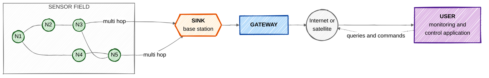

### Architecture of a single sensor node, called a mote

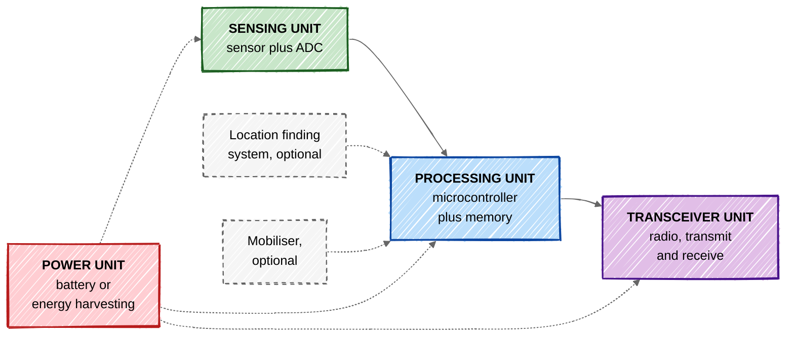

### Characteristics of a WSN

**1. Severe energy constraint.** Nodes run on small batteries that are usually not replaceable, so **energy efficiency dominates every design decision**. The radio is the largest consumer, and the standard design response is duty cycling, in which a node sleeps for most of its life:

```math
\text{Duty cycle} = \frac{T_{\text{active}}}{T_{\text{active}} + T_{\text{sleep}}} \times 100\%
```

A node awake for 1 second in every 1000 has a duty cycle of 0.1 percent, which is what makes a ten year battery life possible.

**2. Self organising and ad hoc.** There is no pre existing infrastructure. Nodes discover their neighbours and form the network themselves after deployment, sometimes after being scattered from an aircraft.

**3. Multi hop communication.** Radio range is short and transmission energy grows steeply with distance, so data is relayed hop by hop rather than sent directly to the sink. Since path loss follows

```math
P_{\text{received}} \propto \frac{1}{d^{\,n}}, \qquad n \approx 2 \text{ to } 4
```

several short hops cost far less energy than one long hop.

**4. Dense deployment.** Nodes are deployed in large numbers and close together, which gives redundancy and better spatial resolution but also causes contention and correlated readings.

**5. Data centric rather than address centric.** A query asks *which regions have a temperature above 40 degrees* rather than *what is the reading of node 27*. Individual node identity often does not matter.

**6. In network processing and data aggregation.** Intermediate nodes combine and summarise data on the way to the sink instead of relaying every packet, which greatly reduces traffic and energy.

**7. Dynamic topology.** Nodes fail, exhaust their batteries, sleep or move, so the topology changes continuously and routing must adapt.

**8. Fault tolerance.** The network must keep functioning when individual nodes fail. Redundant deployment and self healing routing provide this.

**9. Application specific design.** Unlike a general purpose network, a WSN is engineered for one task. A battlefield surveillance network and a greenhouse network share almost no design parameters.

**10. Limited resources.** Typically a few kilobytes of RAM, tens of kilobytes of program memory, an 8 or 16 bit microcontroller and a data rate of a few hundred kilobits per second.

**11. Scalability.** The protocols must work with tens of nodes and with tens of thousands.

**12. Unattended and harsh operation.** Nodes are often deployed where humans cannot easily return, and they must survive weather, vibration and temperature extremes.

**13. Broadcast communication.** The wireless medium is shared, so transmissions are inherently broadcast, which enables efficient flooding but also creates collisions and security exposure.

**14. Low cost per node.** Because thousands are needed, per node cost must be very low, which reinforces every resource constraint above.

### WSN compared with a traditional ad hoc network

| Parameter | WSN | Traditional ad hoc network such as MANET |
|---|---|---|
| Number of nodes | Very large, thousands | Moderate, tens to hundreds |
| Deployment density | Very dense | Sparse |
| Node identity | Often not required, data centric | Required, address centric |
| Energy | Extremely constrained, non replaceable | Rechargeable, less constrained |
| Traffic pattern | Many to one, towards the sink | Any to any, peer to peer |
| Failure rate | High and expected | Lower |
| Hardware cost | Very low per node | Higher |
| Data rate | Low, a few kbps | High, Mbps |

---

## 13. Advantages of Edge and Fog Computing

### The concepts

| Term | Where it runs | Scope |
|---|---|---|
| **Edge computing** | On or immediately beside the device itself, such as the sensor node or a smart camera | A single device or machine |
| **Fog computing** | On an intermediate layer between edge and cloud, such as gateways, routers and local servers | A site, factory or neighbourhood |
| **Cloud computing** | In a remote centralised data centre | Global |

The term **mist computing** is sometimes used for computation on the sensor node itself, at the very extreme edge.

```mermaid
%%{init: {'look':'handDrawn', 'theme':'neutral'}}%%
flowchart TB
    CL["<b>CLOUD</b><br/>unlimited storage and compute<br/>model training, long term trends<br/>latency of 100 ms to seconds"]:::cl
    FG["<b>FOG</b><br/>gateways, local servers, routers<br/>aggregation, short term analytics<br/>latency of tens of milliseconds"]:::fg
    ED["<b>EDGE</b><br/>on or beside the device<br/>filtering, thresholds, safety logic<br/>latency of about 1 ms"]:::ed
    TH["<b>THINGS</b><br/>sensors and actuators"]:::th

    TH -->|"raw data, very high volume"| ED
    ED -->|"filtered events, medium volume"| FG
    FG -->|"summaries, low volume"| CL
    CL -.->|"models and policy down"| FG
    FG -.-> ED

    classDef cl fill:#e1bee7,stroke:#4a148c,stroke-width:2px
    classDef fg fill:#bbdefb,stroke:#0d47a1,stroke-width:2px
    classDef ed fill:#c8e6c9,stroke:#1b5e20,stroke-width:2px
    classDef th fill:#fff9c4,stroke:#f57f17,stroke-width:2px
```

Note the shape of the flow. **Data volume decreases and value per byte increases as you move upward.**

### Advantages

**1. Drastically reduced latency.** Processing happens metres from the source instead of thousands of kilometres away, which is decisive for control loops, robotics, autonomous vehicles and safety interlocks. A round trip to a cloud region may take 100 milliseconds or more, while an edge decision takes about 1 millisecond. An emergency stop cannot wait for the cloud.

**2. Large reduction in bandwidth consumption and cost.** Only meaningful events travel upstream instead of every raw sample. If 500 sensors sample at 10 Hz but the edge forwards only threshold crossings that occur once a minute:

```math
\text{Raw} = 500 \times 10 = 5000 \text{ messages per second}
```
```math
\text{After edge filtering} = \frac{500}{60} \approx 8.3 \text{ messages per second}
```
```math
\text{Reduction} \approx 99.8\%
```

This is often the difference between a deployment that is affordable and one that is not, because backhaul is a recurring cost.

**3. Continued operation when connectivity is lost.** An edge or fog node keeps sensing, deciding and actuating even when the WAN link is down, buffering data for later upload. A factory does not stop because an internet link failed.

**4. Improved privacy and security.** Sensitive raw data such as video, audio, occupancy or patient telemetry can be processed locally and never leave the premises. Only anonymised results are sent upward, which shrinks the attack surface and simplifies compliance with regulations such as GDPR and data residency laws.

**5. Better scalability.** Adding devices adds local compute alongside them, so the architecture scales horizontally instead of overloading a single central point. A purely cloud based design creates an ingestion bottleneck.

**6. Lower operational cost.** Savings come from three directions at once: less backhaul bandwidth, less cloud storage, and fewer cloud compute hours.

**7. Real time analytics and faster decisions.** Anomaly detection, predictive maintenance inference and computer vision can run at the edge on data that is still fresh, rather than on data that is minutes old.

**8. Reduced cloud storage requirement.** Storing every raw sample from thousands of sensors is wasteful. Storing summaries, exceptions and events preserves nearly all the analytical value at a small fraction of the volume.

**9. Location and context awareness.** Fog nodes know where they are and what they serve, which allows location specific rules that a generic cloud service cannot easily express.

**10. Regulatory and jurisdictional compliance.** Some data legally may not cross a national boundary. Local processing satisfies this by construction.

**11. Reduced energy use at the device.** Since radio transmission is the largest energy consumer in a constrained node, sending fewer messages directly extends battery life. Computing locally is usually cheaper than transmitting.

**12. Better reliability and resilience.** There is no single point of failure. A fog node failing affects one site, whereas a cloud region failing affects everyone.

### Comparison

| Parameter | Edge and Fog | Cloud |
|---|---|---|
| Location | At or near the data source | Remote data centre |
| Latency | About 1 ms at the edge, tens of ms at the fog | 100 ms to several seconds |
| Bandwidth requirement | Low | High |
| Compute and storage capacity | Limited | Effectively unlimited |
| Works without internet | Yes | No |
| Data privacy | Data can stay local | Data leaves the premises |
| Best suited to | Real time control, filtering, safety, local analytics | Big data, model training, long term storage, global reporting |
| Cost model | Capital expenditure on local hardware | Operational expenditure per usage |

### Practical conclusion

Edge, fog and cloud are **complementary rather than competing**. The correct design places each function where it belongs: **time critical decisions at the edge, site wide coordination and short term analytics at the fog, and heavy model training and long term historical analysis in the cloud.** A predictive maintenance system illustrates this well, as the edge detects a vibration anomaly in milliseconds, the fog correlates it across all machines on the line, and the cloud retrains the failure prediction model on years of data from every plant.

---

## 14. WSN Applications

WSNs are deployed wherever a physical phenomenon must be monitored over an area that is too large, too remote, too hazardous or too dense to instrument by hand.

```mermaid
%%{init: {'look':'handDrawn', 'theme':'neutral'}}%%
flowchart TD
    W["<b>WSN APPLICATIONS</b>"]:::root
    W --> A["Environmental"]:::c
    W --> B["Military and<br/>Security"]:::c
    W --> C["Healthcare"]:::c
    W --> D["Agriculture"]:::c
    W --> E["Industrial"]:::c
    W --> F["Smart Home and<br/>Smart City"]:::c
    W --> G["Structural and<br/>Infrastructure"]:::c
    W --> H["Transport and<br/>Logistics"]:::c

    classDef root fill:#fff3e0,stroke:#e65100,stroke-width:3px
    classDef c fill:#e3f2fd,stroke:#0d47a1,stroke-width:2px
```

### 1. Environmental monitoring

Nodes are scattered over forests, rivers, glaciers and volcanoes to measure temperature, humidity, air quality, water quality and seismic activity.

- **Forest fire detection.** Dense temperature and smoke nodes report the exact origin of a fire early, when it can still be contained.
- **Flood and river monitoring.** Water level and rainfall nodes feed early warning systems.
- **Air quality networks.** Distributed particulate and gas sensors map pollution street by street rather than at one city station.
- **Habitat and wildlife monitoring.** The classic Great Duck Island deployment monitored seabird burrows without human disturbance.
- **Volcano and earthquake monitoring.** Seismic nodes on a volcano flank report tremor patterns in real time.

### 2. Military and security

WSNs originated in defence research, and this remains a major domain.

- **Battlefield surveillance.** Acoustic, magnetic and seismic nodes detect vehicle and troop movement.
- **Intrusion detection** along borders and around perimeters.
- **Nuclear, biological and chemical attack detection**, which keeps personnel away from contaminated zones.
- **Targeting and battle damage assessment.**
- **Sniper localisation** using distributed acoustic arrays that triangulate the muzzle blast.

### 3. Healthcare and Wireless Body Area Networks

- **Patient monitoring.** ECG, blood pressure, SpO2 and temperature nodes on a patient replace tethered bedside monitors and allow mobility.
- **Elderly and assisted living.** Fall detection, activity monitoring and medication reminders enable independent living.
- **Implantable and wearable devices**, such as continuous glucose monitors and pacemaker telemetry.
- **Hospital asset and staff tracking.**
- **Drug administration and inventory management**, verifying the right drug and dose.

### 4. Agriculture and precision farming

- **Soil moisture and nutrient monitoring** for irrigation applied only where it is needed, which saves water substantially.
- **Microclimate monitoring** in greenhouses and vineyards, controlling temperature, humidity and light.
- **Livestock monitoring**, tracking location, body temperature and rumination to detect illness or oestrus early.
- **Pest and disease prediction** from leaf wetness and humidity patterns.
- **Cold chain monitoring** of produce from field to retail.

### 5. Industrial and machine monitoring

- **Predictive maintenance.** Vibration, temperature and current nodes on motors, pumps and bearings detect degradation before failure.
- **Process monitoring and control** in chemical plants and refineries, often using WirelessHART or ISA100.11a.
- **Machine health and utilisation** measurement for OEE calculation.
- **Worker safety**, including gas leak detection and man down alarms.
- **Inventory and asset tracking** across large warehouses and yards.

### 6. Smart home and smart city

- **Smart lighting** that dims when a street is empty.
- **Smart parking.** Magnetic or ultrasonic nodes in each bay guide drivers directly to a free space, which reduces circling traffic.
- **Waste management.** Fill level sensors in bins allow collection routes to be optimised.
- **Smart metering** of electricity, water and gas with automatic reading and leak detection.
- **Home automation and security**, including door, window and motion sensing.
- **Noise and pollution mapping** across the city.

### 7. Structural health monitoring

- **Bridges, dams, tunnels and buildings.** Strain gauges, accelerometers and inclinometers detect cracks, fatigue and displacement long before visual inspection would.
- **Post earthquake assessment**, indicating quickly whether a structure is safe to re enter.
- **Heritage building conservation**, monitoring humidity and vibration around fragile structures.
- **Mine safety**, monitoring roof movement and gas concentration.

### 8. Transport and logistics

- **Vehicle tracking and fleet management.**
- **Traffic flow monitoring** using roadside nodes that count and classify vehicles.
- **Railway monitoring** of track condition, axle temperature and level crossings.
- **Container and cold chain tracking**, logging temperature, shock and door opening throughout a shipment.

### Requirements mapped to application

| Application | Dominant requirement | Typical technology |
|---|---|---|
| Forest fire detection | Very long battery life, wide area | LoRaWAN, Sigfox |
| Patient monitoring | Reliability, low latency, low power | BLE, Zigbee Health Care |
| Industrial process control | Determinism, reliability, security | WirelessHART, ISA100.11a |
| Precision agriculture | Range, cost per node, battery life | LoRaWAN, NB-IoT |
| Structural health monitoring | High sample rate, time synchronisation | 802.15.4, wired backbone |
| Smart parking | Very low cost, ten year battery | LoRaWAN, NB-IoT |
| Battlefield surveillance | Rapid self organisation, stealth, robustness | Custom 802.15.4 mesh |

---

## 15. Classless vs Classful Addressing

### Classful Addressing

The original IPv4 scheme divided the 32 bit address space into **five fixed classes** identified by the leading bits of the first octet. The boundary between the network part and the host part was **fixed by the class**.

| Class | Leading bits | First octet | NetID and HostID | Networks | Hosts per network | Default mask |
|---|---|---|---|---|---|---|
| A | `0` | 0 to 127 | 8 and 24 | $2^{7} = 128$ | $2^{24}-2 = 16{,}777{,}214$ | 255.0.0.0 |
| B | `10` | 128 to 191 | 16 and 16 | $2^{14} = 16{,}384$ | $2^{16}-2 = 65{,}534$ | 255.255.0.0 |
| C | `110` | 192 to 223 | 24 and 8 | $2^{21} = 2{,}097{,}152$ | $2^{8}-2 = 254$ | 255.255.255.0 |
| D | `1110` | 224 to 239 | Multicast | Not applicable | Not applicable | Not defined |
| E | `1111` | 240 to 255 | Reserved | Not applicable | Not applicable | Not defined |

### Classless Addressing, CIDR

CIDR, defined in RFC 1519, **abolishes the classes entirely**. The prefix length is carried explicitly with the address as `x.y.z.w/n`, so the network and host boundary can be placed at any bit position.

```math
\text{Total addresses in a block} = 2^{\,32-n}, \qquad \text{Usable hosts} = 2^{\,32-n} - 2
```

A valid block must satisfy three rules: the number of addresses is a power of two, the addresses are contiguous, and the **first address is divisible by the block size**.

### The wastage problem, illustrated

An organisation needing **300 addresses**:

| Scheme | Block granted | Addresses given | Wasted |
|---|---|---|---|
| Classful | One Class B, since Class C gives only 254 | 65,536 | 65,236, that is 99.5 percent |
| Classless | A `/23` block | 512 | 212, that is 41 percent |

```math
\text{Classful waste} = \frac{65{,}536-300}{65{,}536} \times 100 \approx 99.54\%
```
```math
\text{Classless waste} = \frac{512-300}{512} \times 100 \approx 41.4\%
```

### Route aggregation, the second major gain

Four contiguous Class C networks under classful addressing require four separate routing table entries. Under CIDR they collapse into one:

```mermaid
%%{init: {'look':'handDrawn', 'theme':'neutral'}}%%
flowchart LR
    subgraph CF["CLASSFUL : 4 routing entries"]
        direction TB
        A1["200.1.0.0 / 255.255.255.0"]:::old
        A2["200.1.1.0 / 255.255.255.0"]:::old
        A3["200.1.2.0 / 255.255.255.0"]:::old
        A4["200.1.3.0 / 255.255.255.0"]:::old
    end
    subgraph CL["CLASSLESS : 1 routing entry"]
        direction TB
        B1["<b>200.1.0.0/22</b><br/>1024 addresses<br/>supernet"]:::new
    end
    CF -->|"aggregation or supernetting"| CL

    classDef old fill:#ffcdd2,stroke:#b71c1c,stroke-width:2px
    classDef new fill:#c8e6c9,stroke:#1b5e20,stroke-width:3px
```

### Full comparison

| Parameter | Classful Addressing | Classless Addressing, CIDR |
|---|---|---|
| Basis of division | Five predefined classes A to E | No classes at all |
| Network and host boundary | Fixed by the class at bit 8, 16 or 24 | Variable, at any bit position from the prefix |
| Subnet mask | Implied by the class, not transmitted | Explicit, carried as `/n` and always advertised |
| Notation | `192.168.10.5` with the class understood | `192.168.10.5/26` |
| Block sizes available | Only 3 sizes, roughly 16.7 M, 65 K and 254 | Any power of two from 2 to $2^{32}$ |
| Address utilisation | Very poor, huge wastage | Efficient, block sized to actual need |
| VLSM support | Not supported | Fully supported |
| Route aggregation or supernetting | Not possible | Core feature |
| Routing table size | Large and growing uncontrollably | Greatly reduced through aggregation |
| Routing protocols | Classful, such as RIPv1 and IGRP | Classless, such as RIPv2, OSPF, EIGRP, BGP4 |
| Broadcast handling | Class based directed broadcast | Prefix based |
| Flexibility | Rigid | Highly flexible and hierarchical |
| Introduced | 1981, RFC 791 | 1993, RFC 1519 |
| Status today | Obsolete, historical interest only | Universal standard on the internet |

### Worked contrast

Suppose an ISP holds `190.100.0.0/16` and a customer needs **1000 addresses**.

**Under classful addressing** there is no suitable size. Four Class C networks would have to be granted, producing four unrelated routing entries and no guarantee they are contiguous.

**Under classless addressing** the ISP grants a single `/22`:

```math
2^{32-22} = 2^{10} = 1024 \text{ addresses}
```

giving `190.100.4.0` to `190.100.7.255` as one contiguous, aggregatable block with 1022 usable hosts.

### Conclusion

Classful addressing was simple but wasteful, and it would have exhausted IPv4 far sooner than actually happened. Classless addressing solved both the **exhaustion problem** through right sized blocks and VLSM, and the **routing table explosion problem** through aggregation. It is the reason IPv4 remained usable long enough for IPv6 to be developed and deployed.

---

## Rendering notes

| Feature | Where it works |
|---|---|
| Mermaid diagrams | `github.com` file view, README, issues, PRs, Gists |
| LaTeX in ` ```math ` blocks and `$…$` | `github.com` file view, README, issues, PRs |
| `look: handDrawn` | Mermaid v11 and above. On older versions the directive is ignored and the diagram renders in the normal style, so nothing breaks. |
| GitHub Wiki | Mermaid is **not** rendered |
| GitHub Pages with Jekyll | Requires the Mermaid JS snippet to be added to the layout |

To also give the diagram text a handwritten typeface, extend the init directive:

```
%%{init: {'look':'handDrawn', 'themeVariables': {'fontFamily':'Comic Sans MS, Segoe Print, cursive'}}}%%
```

> The **body text** of a Markdown file cannot use a custom font on `github.com`, because GitHub strips `<style>` tags and CSS when rendering Markdown. A handwritten typeface for the prose is only possible through **GitHub Pages** with a custom stylesheet, or by exporting to PDF locally.

---

*End of solution set.*
